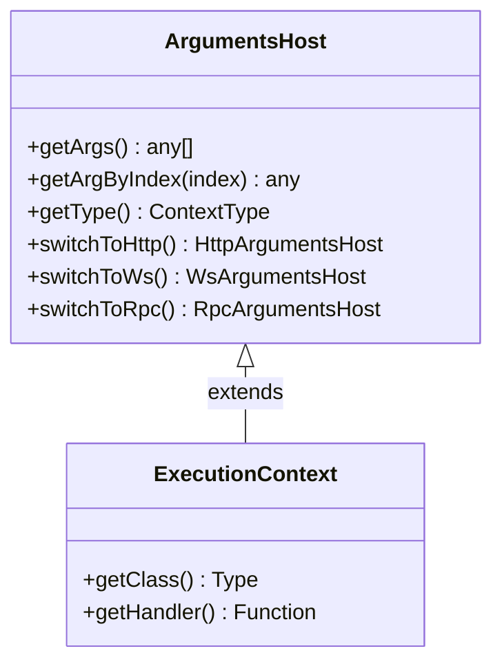

# NestJS ExecutionContext & ArgumentsHost Deep Dive

**Date:** 2026-07-24  
**Topics:** `NestJS`, `ExecutionContext`, `ArgumentsHost`, `Reflector`, `Metadata`, `Guards`, `Interceptors`, `ExceptionFilters`  
**Source Provenance:** NestJS Official Documentation (`docs.nestjs.com/fundamentals/execution-context`)

---

## 1. Overview & Architecture Relationship

NestJS is designed to be **platform and protocol agnostic**. A single NestJS application can handle HTTP requests (Express/Fastify), WebSockets, Microservices/RPC (gRPC, NATS, RabbitMQ), and GraphQL.

To provide a unified interface across all these transport layers, NestJS introduces two core abstractions:

1. **`ArgumentsHost`**: A low-level wrapper around the raw handler arguments.
2. **`ExecutionContext`**: A high-level class that **extends `ArgumentsHost`** and adds metadata reflection capabilities (`getClass()` and `getHandler()`).



---

## 2. `ArgumentsHost`: The Multi-Protocol Argument Wrapper

### Purpose

`ArgumentsHost` abstracts the underlying array of arguments passed to a handler function. For instance:

- In HTTP (Express): `[req, res, next]`
- In WebSockets: `[client, data, socket]`
- In GraphQL: `[root, args, context, info]`

### Key API Methods

```typescript
export interface ArgumentsHost {
  getArgs<T extends Array<any> = any[]>(): T;
  getArgByIndex<T = any>(index: number): T;
  getType<TContext extends string = ContextType>(): TContext;

  switchToHttp(): HttpArgumentsHost;
  switchToWs(): WsArgumentsHost;
  switchToRpc(): RpcArgumentsHost;
}
```

### Context Switching Helpers

| Method           | Return Type         | Primary Purpose                                           |
| :--------------- | :------------------ | :-------------------------------------------------------- |
| `switchToHttp()` | `HttpArgumentsHost` | Extract HTTP `getRequest()`, `getResponse()`, `getNext()` |
| `switchToWs()`   | `WsArgumentsHost`   | Extract WebSocket `getClient()`, `getData()`              |
| `switchToRpc()`  | `RpcArgumentsHost`  | Extract Microservice `getData()`, `getContext()`          |

### Primary Use Case: Exception Filters

Exception Filters typically only need to format and send the response back to the client. They use `ArgumentsHost` because they do not need to inspect the target Controller class or handler method:

```typescript
import {
  ExceptionFilter,
  Catch,
  ArgumentsHost,
  HttpException,
} from "@nestjs/common";
import { Request, Response } from "express";

@Catch(HttpException)
export class GlobalExceptionFilter implements ExceptionFilter {
  catch(exception: HttpException, host: ArgumentsHost) {
    const ctx = host.switchToHttp();
    const response = ctx.getResponse<Response>();
    const request = ctx.getRequest<Request>();
    const status = exception.getStatus();

    response.status(status).json({
      statusCode: status,
      timestamp: new Date().toISOString(),
      path: request.url,
      message: exception.message,
    });
  }
}
```

---

## 3. `ExecutionContext`: Reflection & Pipeline Metadata

### Purpose

`ExecutionContext` extends `ArgumentsHost`. In addition to accessing raw request/response objects, it allows Guards and Interceptors to **reflect on the current execution pipeline**—knowing exactly which Controller class and handler method are executing.

### Key API Extension Methods

```typescript
export interface ExecutionContext extends ArgumentsHost {
  /**
   * Returns the Type (class reference) of the controller class.
   * e.g., AuthController
   */
  getClass<T = any>(): Type<T>;

  /**
   * Returns a reference to the handler method that will be invoked.
   * e.g., changePassword()
   */
  getHandler(): Function;
}
```

---

## 4. Metadata Reflection via `Reflector`

The primary reason **Guards** and **Interceptors** receive `ExecutionContext` (rather than plain `ArgumentsHost`) is to read custom metadata attached via decorators (`@SetMetadata`, `@Public()`, `@Roles()`).

### Reflection Methods

`Reflector` provides 3 primary helper methods:

1. **`reflector.get<T>(metadataKey, target)`**: Reads metadata from a single target (either method or class).
2. **`reflector.getAllAndOverride<T>(metadataKey, targets)`**: Reads metadata from targets in order, returning the **first defined value** (Handler metadata overrides Class metadata).
3. **`reflector.getAllAndMerge<T>(metadataKey, targets)`**: Reads metadata from all targets and **merges arrays/objects** together.

### Real-World Example: Role-Based Authorization Guard

```typescript
import { Injectable, CanActivate, ExecutionContext } from "@nestjs/common";
import { Reflector } from "@nestjs/core";

@Injectable()
export class RolesGuard implements CanActivate {
  constructor(private readonly reflector: Reflector) {}

  canActivate(context: ExecutionContext): boolean {
    // Read required roles attached to Handler or Class
    const requiredRoles = this.reflector.getAllAndOverride<string[]>("roles", [
      context.getHandler(), // 1st check: Method-level @Roles()
      context.getClass(), // 2nd check: Controller-level @Roles()
    ]);

    if (!requiredRoles) {
      return true; // No roles specified -> public endpoint
    }

    const request = context.switchToHttp().getRequest();
    const user = request.user;

    return requiredRoles.some((role) => user?.roles?.includes(role));
  }
}
```

---

## 5. Comparison Summary: `ArgumentsHost` vs `ExecutionContext`

| Feature / Aspect          | `ArgumentsHost`                                     | `ExecutionContext`                                                                 |
| :------------------------ | :-------------------------------------------------- | :--------------------------------------------------------------------------------- |
| **Hierarchy**             | Base Interface                                      | Extends `ArgumentsHost`                                                            |
| **Contained Data**        | Raw argument array (`req`, `res`, `client`, `data`) | Raw arguments + Controller Class & Handler Method references                       |
| **Switching Contexts**    | `switchToHttp()`, `switchToWs()`, `switchToRpc()`   | Inherited from `ArgumentsHost`                                                     |
| **Reflection Capability** | ❌ None                                             | ✅ `getClass()` & `getHandler()` for `Reflector` integration                       |
| **Primary Placement**     | **Exception Filters** (`catch(exception, host)`)    | **Guards** (`canActivate(context)`), **Interceptors** (`intercept(context, next)`) |

---

## 6. Best Practices

1. **Use `switchToHttp()` for Platform Independence**:
   Avoid accessing `host.getArgs()[0]` directly by index. Always use `host.switchToHttp().getRequest()` for type-safe and platform-independent access.
2. **Prefer `getAllAndOverride` for Method-level Overrides**:
   When combining Class-level decorators (e.g. `@Roles('user')`) with Method-level decorators (e.g. `@Roles('admin')`), use `reflector.getAllAndOverride()` so the specific method rule takes precedence over the controller default.
3. **Keep Context Clean**:
   `ExecutionContext` reflects on runtime instances. Do not modify or monkey-patch `context.getClass()` or `context.getHandler()` references.
