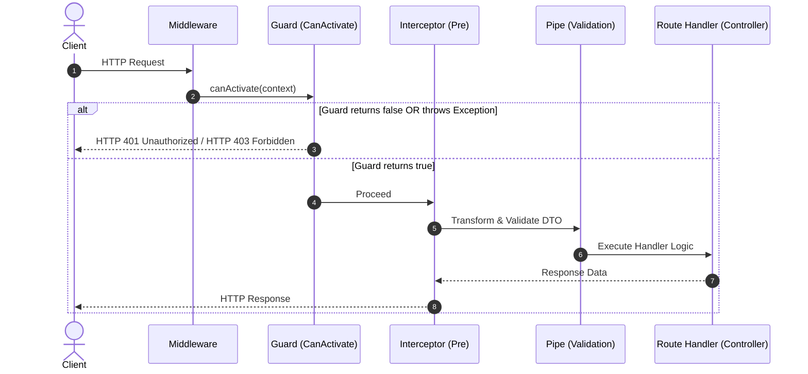

# NestJS Guards & CanActivate Interface Deep Dive

**Date:** 2026-07-24  
**Topics:** `NestJS`, `Security`, `Authentication`, `Authorization`, `Guards`, `CanActivate`, `ExecutionContext`  
**Reference Codebase:** `src/common/guards/jwt-auth.guard.ts`  
**Source Provenance:** NestJS Official Documentation (`docs.nestjs.com/guards`, `docs.nestjs.com/faq/request-lifecycle`) & Production Codebase

---

## 1. Overview & Single Responsibility Principle

In NestJS, a **Guard** is a class annotated with `@Injectable()` that implements the `CanActivate` interface.

Guards have a **single responsibility**: They determine whether a given request will be handled by the route handler or not, depending on runtime conditions such as authentication status, permissions, roles, or rate limits.

Unlike traditional Express middleware, NestJS Guards have access to the **`ExecutionContext`** instance. This allows them to know exactly which Controller method (handler) and class are about to be executed, enabling powerful metadata-driven decisions via `Reflector`.

---

## 2. The `CanActivate` Contract & Signature

Every Guard **must** implement the `CanActivate` interface from `@nestjs/common`.

```typescript
import { CanActivate, ExecutionContext } from "@nestjs/common";
import { Observable } from "rxjs";

export interface CanActivate {
  canActivate(
    context: ExecutionContext,
  ): boolean | Promise<boolean> | Observable<boolean>;
}
```

### Return Value Semantics

The single required method `canActivate()` receives `ExecutionContext` and must return:

- `true` $\rightarrow$ Request passes the guard and proceeds to interceptors/pipes/route handler.
- `false` $\rightarrow$ Request is blocked. NestJS automatically throws `ForbiddenException` (HTTP 403).
- `throw new UnauthorizedException(...)` $\rightarrow$ Custom HTTP 401 exception (recommended for authentication failures).

### Why `implements CanActivate`?

Implementing `CanActivate` tells NestJS that the class is a **Guard**. NestJS will:

1. Instantiate the class via its Dependency Injection (DI) container.
2. Call `canActivate()` before invoking the protected route handler.
3. Use the return value (or thrown exception) to decide whether to allow the request.

Without this interface, NestJS will not recognize the class as a valid guard and `@UseGuards(JwtAuthGuard)` will have no effect.

---

## 3. NestJS Request-Response Lifecycle & Position of Guards

Guards are executed **after** all middlewares are processed, but **before** any Interceptors, Pipes, or Controller Route Handlers.



### Execution Order Comparison Matrix

| Layer           | Runs Before Handler | Access to `ExecutionContext` | Primary Use Case                                            | Short-circuiting                  |
| :-------------- | :------------------ | :--------------------------- | :---------------------------------------------------------- | :-------------------------------- |
| **Middleware**  | Yes                 | No (`req`, `res`, `next`)    | Logging, CORS, Body parsing, Session setup                  | Yes (`next()`)                    |
| **Guard**       | Yes                 | **Yes**                      | Authentication (JWT), Authorization (ACL/RBAC), Throttling  | Yes (return `false` / `throw`)    |
| **Interceptor** | Yes & After         | **Yes**                      | Response mapping, Performance profiling, Caching            | Yes                               |
| **Pipe**        | Yes                 | **Yes**                      | Payload validation (`class-validator`), Type transformation | Yes (`throw BadRequestException`) |

### Order of Execution when Multiple Guards are Present

Per official [NestJS Request Lifecycle Docs](https://docs.nestjs.com/faq/request-lifecycle), when multiple guards are configured:

1. **Global Guards** run first.
2. **Controller-level Guards** run second.
3. **Route/Method-level Guards** run third.

_Note:_ Within the same level, guards run in the **exact array order** they are bound: `@UseGuards(GuardA, GuardB)` will execute `GuardA.canActivate()` followed by `GuardB.canActivate()`. If `GuardA` returns `false` or throws an exception, `GuardB` is **short-circuited** and will never execute.

---

## 4. `ExecutionContext` vs Raw Request Object

`ExecutionContext` inherits from `ArgumentsHost`. It provides an abstraction over the underlying platform (Express/Fastify/Microservices/WebSockets/GraphQL):

```typescript
// Switch to HTTP context and extract Express/Fastify Request
const request = context.switchToHttp().getRequest<Request>();
```

### Multi-Protocol Flexibility

- **HTTP**: `context.switchToHttp().getRequest()`
- **WebSockets**: `context.switchToWs().getClient()`
- **Microservices / RPC**: `context.switchToRpc().getData()`
- **GraphQL**: `GqlExecutionContext.create(context).getContext()`

---

## 5. Throwing vs Returning `false` Semantics

| Behavior                          | Result Status                | Recommended Use Case                                                      |
| :-------------------------------- | :--------------------------- | :------------------------------------------------------------------------ |
| **Return `false`**                | HTTP 403 Forbidden           | Rarely — loses error context & produces generic 403                       |
| **Throw `UnauthorizedException`** | HTTP 401 Unauthorized        | **Preferred for Authentication failures** (missing/invalid token)         |
| **Throw `ForbiddenException`**    | HTTP 403 Forbidden           | **Preferred for Authorization failures** (insufficient permissions/roles) |
| **Throw Custom `HttpException`**  | Custom HTTP Status & Payload | Specialized domain errors                                                 |

For authentication failures (missing/invalid/expired token), always throw `UnauthorizedException` with i18n localization rather than returning `false`. This preserves the correct HTTP 401 status and provides meaningful localized feedback.

---

## 6. Production Implementation Analysis: `JwtAuthGuard`

Below is the production implementation of `JwtAuthGuard` from `src/common/guards/jwt-auth.guard.ts`:

```typescript
import {
  type CanActivate,
  type ExecutionContext,
  Injectable,
  UnauthorizedException,
} from "@nestjs/common";
import { JwtService } from "@nestjs/jwt";
import { env } from "@/env";
import type { Request } from "express";
import type { JwtPayload } from "@/common/decorators/current-user.decorator";
import { I18nContext } from "nestjs-i18n";
import type { I18nTranslations } from "@/generated/i18n.generated";

// WHY: Ambient module augmentation to attach `user?: JwtPayload` to Express.Request
// eslint-disable-next-line @typescript-eslint/no-namespace
declare global {
  namespace Express {
    interface Request {
      user?: JwtPayload;
    }
  }
}

@Injectable()
export class JwtAuthGuard implements CanActivate {
  constructor(private readonly jwtService: JwtService) {}

  async canActivate(context: ExecutionContext): Promise<boolean> {
    const request = context.switchToHttp().getRequest<Request>();
    const token = this.extractTokenFromHeader(request);

    if (!token) {
      this.throwUnauthorized();
    }

    try {
      const payload = await this.jwtService.verifyAsync<JwtPayload>(token, {
        secret: env.JWT_SECRET,
      });
      // Attach verified payload to HTTP request object for downstream @CurrentUser()
      request.user = payload;
    } catch {
      this.throwUnauthorized();
    }

    return true;
  }

  private extractTokenFromHeader(request: Request): string | undefined {
    const [type, token] = request.headers.authorization?.split(" ") ?? [];
    return type === "Bearer" ? token : undefined;
  }

  private throwUnauthorized(): never {
    const i18n = I18nContext.current<I18nTranslations>()?.service;
    const lang = I18nContext.current()?.lang;

    const message = i18n
      ? i18n.t("auth.TOKEN_INVALID_OR_EXPIRED", { lang })
      : "Unauthorized";

    throw new UnauthorizedException(message);
  }
}
```

---

## 7. Guard Binding Strategies

NestJS supports three levels of Guard binding:

### 1. Method / Endpoint Level

```typescript
@Post("change-password")
@UseGuards(JwtAuthGuard)
async changePassword(
  @CurrentUser("sub") userId: string,
  @Body() dto: ChangePasswordDto,
) {
  return this.authService.changePassword(userId, dto);
}
```

### 2. Controller Level (Applies to all routes in class)

```typescript
@UseGuards(JwtAuthGuard)
@Controller("users")
export class UserController { ... }
```

### 3. Global Guard (Module Provider Level - Recommended for DI)

```typescript
@Module({
  providers: [
    {
      provide: APP_GUARD,
      useClass: JwtAuthGuard,
    },
  ],
})
export class AppModule {}
```

---

## 8. Metadata Reflection (`Reflector`) & Bypass Patterns

To bypass global or controller-level guards (e.g. `@Public()` endpoints), NestJS uses `Reflector`:

```typescript
// Custom Decorator
export const IS_PUBLIC_KEY = "isPublic";
export const Public = () => SetMetadata(IS_PUBLIC_KEY, true);

// Inside Guard
@Injectable()
export class JwtAuthGuard implements CanActivate {
  constructor(
    private readonly jwtService: JwtService,
    private readonly reflector: Reflector,
  ) {}

  async canActivate(context: ExecutionContext): Promise<boolean> {
    const isPublic = this.reflector.getAllAndOverride<boolean>(IS_PUBLIC_KEY, [
      context.getHandler(),
      context.getClass(),
    ]);

    if (isPublic) {
      return true;
    }

    // Normal JWT validation logic...
  }
}
```

---

## 9. Best Practices & Common Pitfalls

1. **Keep Guards Single-Purpose**:
   Guards should only perform authentication/authorization checks. Do not mutate entity data or execute main business workflows inside `canActivate()`.
2. **Type Safety & Express Augmentation**:
   When attaching custom properties to `request` (e.g., `request.user`), use ambient module augmentation `declare global { namespace Express { interface Request { ... } } }` with explicit ESLint suppression (`// eslint-disable-next-line @typescript-eslint/no-namespace`).
3. **i18n & Exception Consistency**:
   Throw explicit NestJS HTTP Exceptions (`UnauthorizedException`, `ForbiddenException`) with i18n localized messages rather than returning `false`.
4. **Document Guard Contracts**:
   Document guard behavior in OpenAPI decorators (`@ApiBearerAuth()`) and endpoint JSDoc.
