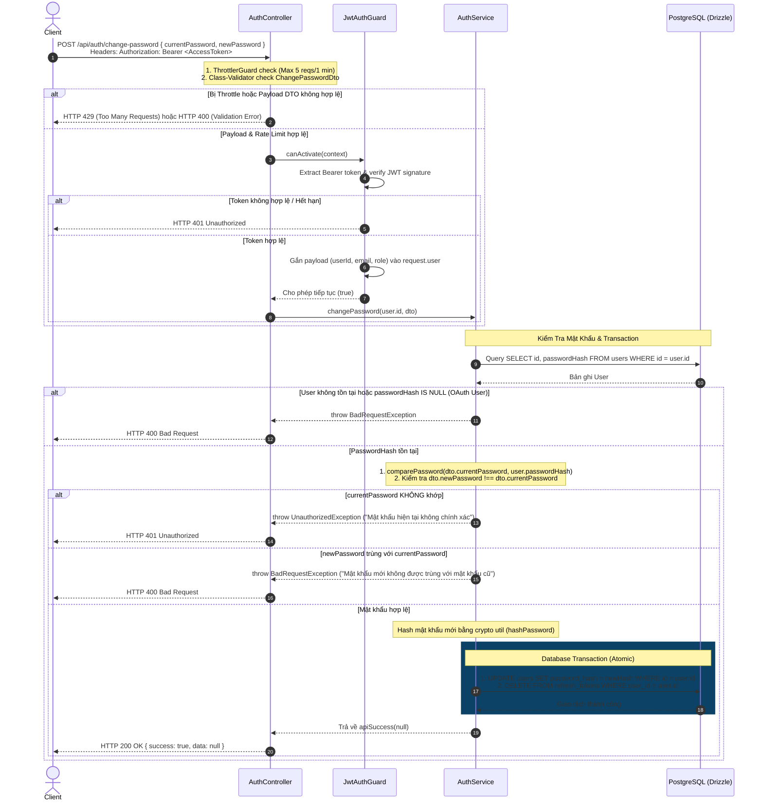

# Phân Tích & Thiết Kế Workflow: Đổi Mật Khẩu (Change Password Flow)

**Trạng thái**: ✅ Approved  
**Module**: `src/modules/auth`  
**Route/Endpoint**: `POST /api/auth/change-password`  

---

## 1. Sơ Đồ Phân Rã Chức Năng (Work Breakdown Structure - WBS)

| Mã WBS | Thành Phần / Chức Năng | Phân Cấp (Level) | Mô Tả Chi Tiết / Nhiệm Vụ | Output / Artifact |
| :--- | :--- | :--- | :--- | :--- |
| **1.0** | **Auth Module** | **L1: Module** | Quản lý xác thực và phân quyền tài khoản | `src/modules/auth` |
| **1.1** | **Change Password Feature** | **L2: Feature** | Chức năng đổi mật khẩu người dùng | `POST /api/auth/change-password` |
| **1.1.1** | **Auth & Guard Layer** | **L3: Logic** | Xác thực Token & trích xuất User Context | `JwtAuthGuard`, `@CurrentUser()` |
| 1.1.1.1 | Access Token Verification | L4: Execution | Verify Bearer Token từ Header `Authorization` | `src/common/guards/jwt-auth.guard.ts` |
| 1.1.1.2 | User Context Decorator | L4: Execution | Trích xuất user id/payload từ `request.user` | `src/common/decorators/current-user.decorator.ts` |
| **1.1.2** | **Input DTO & Validation** | **L3: Logic** | Validate dữ liệu mật khẩu cũ và mới | `ChangePasswordDto` |
| 1.1.2.1 | Payload Validation | L4: Execution | Kiểu dữ liệu, độ dài tối thiểu (8 chars), chữ hoa, số | `src/modules/auth/dto/change-password.dto.ts` |
| 1.1.2.2 | Multi-language Messages | L4: Execution | Ánh xạ lỗi Validation qua `nestjs-i18n` | `src/i18n/{en,vi}/validation.json` |
| **1.1.3** | **Business Logic & Crypto** | **L3: Logic** | Xử lý đối soát mật khẩu & cập nhật mã hóa | `AuthService.changePassword()` |
| 1.1.3.1 | Verify Current Password | L4: Execution | So sánh `currentPassword` với DB `passwordHash` | `src/common/utils/crypto.util.ts` |
| 1.1.3.2 | Password Change Rules | L4: Execution | Chống dùng lại mật khẩu mới trùng mật khẩu cũ | `AuthService` logic |
| 1.1.3.3 | Password Hashing | L4: Execution | Hash mật khẩu mới bằng `hashPassword()` | `src/common/utils/crypto.util.ts` |
| 1.1.3.4 | Atomic DB Transaction | L4: Execution | Cập nhật `passwordHash` và xoá toàn bộ refresh tokens | `src/database/schemas/auth.schema.ts` |
| **1.1.4** | **Session Invalidation** | **L3: Logic** | Thu hồi toàn bộ phiên đăng nhập cũ (Force Logout) | Global Session Revocation |
| 1.1.4.1 | Delete Refresh Tokens | L4: Execution | `DELETE FROM refresh_tokens WHERE user_id = :userId` | DB Table `refresh_tokens` |
| **1.1.5** | **Security & Rate Limiting** | **L3: Logic** | Bảo vệ chống Bruteforce & Spam | `ThrottlerGuard` |
| 1.1.5.1 | IP/User Throttling | L4: Execution | Tối đa 5 lượt gọi API / 1 phút trên mỗi IP/User | `@Throttle({ auth: { limit: 5, ttl: 60000 } })` |

---

## 2. Sơ Đồ Workflow Đổi Mật Khẩu (Sequence Diagram)

Dưới đây là sơ đồ tuần tự chi tiết mô tả toàn bộ vòng đời của yêu cầu đổi mật khẩu:

---

## 3. Quyết Định Kiến Trúc & Thiết Kế Kỹ Thuật (Tech Decisions)

### 3.1 Routing & Route Constants (`src/modules/auth/auth.routes.ts`)
Bổ sung `CHANGE_PASSWORD: "change-password"` vào hằng số `AUTH_ROUTES`.

### 3.2 Protection Layer: `JwtAuthGuard` & `@CurrentUser()`
Xác thực Access Token qua `JwtAuthGuard` và trích xuất `userId` an toàn từ `request.user` qua Custom Decorator `@CurrentUser('id')`.

### 3.3 Atomic Transaction & Session Invalidation
Phương thức `changePassword` thực hiện bọc việc cập nhật `passwordHash` và lệnh `DELETE FROM refresh_tokens WHERE user_id = :userId` trong **1 Database Transaction duy nhất** để đảm bảo tính nguyên tử (Atomic).

---

## 4. Chiến Lược Bảo Vệ Nhiều Lớp (Defense-in-Depth & Security)

1. **Authentication & Identity Ownership**: Yêu cầu đồng thời Access Token hợp lệ và đúng `currentPassword` (chống Session Takeover).
2. **Global Session Revocation**: Xóa toàn bộ `refresh_tokens` trong DB sau khi đổi mật khẩu thành công để buộc tất cả các thiết bị khác đăng nhập lại.
3. **Password Reuse Prevention**: Cấm nhập `newPassword === currentPassword`.
4. **Rate Limiting**: Áp dụng `@Throttle({ auth: { limit: 5, ttl: 60000 } })` chống bruteforce.

---

## 5. Kế Hoạch Triển Khai (Implementation Checklist)

- [x] Decorator `@CurrentUser()` (`src/common/decorators/current-user.decorator.ts`).
- [x] Guard `JwtAuthGuard` (`src/common/guards/jwt-auth.guard.ts`).
- [x] DTO `ChangePasswordDto` (`src/modules/auth/dto/change-password.dto.ts`).
- [x] Bổ sung `CHANGE_PASSWORD` route constant.
- [x] Chuỗi i18n đa ngôn ngữ cho Change Password.
- [x] Phương thức `changePassword` trong `AuthService`.
- [x] Endpoint `@Post(AUTH_ROUTES.CHANGE_PASSWORD)` trong `AuthController`.
- [x] Unit Tests (`auth.service.spec.ts` & `auth.controller.spec.ts`).

---

## 6. Tài Liệu Liên Quan
- [[Workflow_Documentation_Standard]]
- [[RFC_9457_Problem_Details_Deep_Dive]]
- [[Guards_and_CanActivate_Deep_Dive]]
