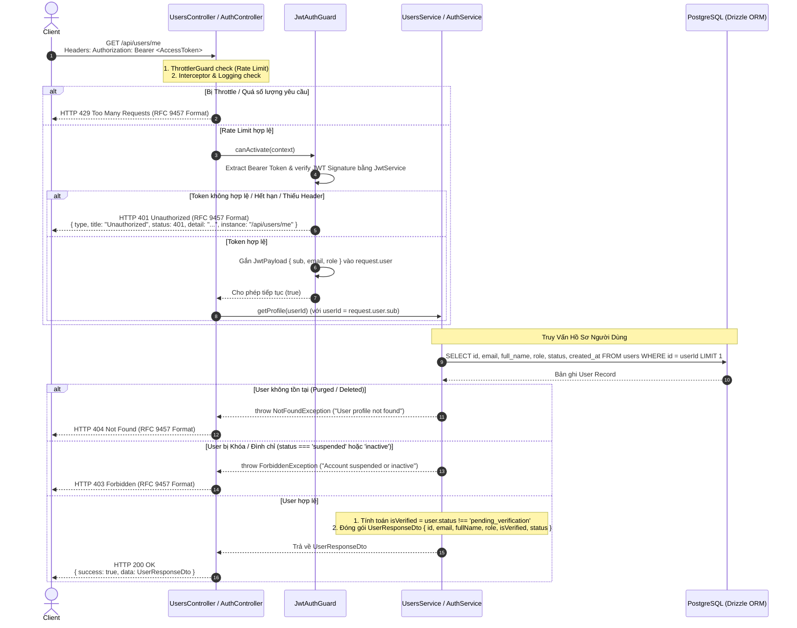

# Phân Tích & Thiết Kế Workflow: Lấy Thông Tin Hồ Sơ Người Dùng Hiện Tại (Get Current User Profile Flow)

**Trạng thái**: ⏳ Draft (Theo Issue #24)  
**Module**: `src/modules/users` (hoặc `src/modules/auth`)  
**Route/Endpoint**: `GET /api/users/me` (Alias hỗ trợ: `GET /api/auth/me`)

---

## 1. Sơ Đồ Phân Rã Chức Năng (Work Breakdown Structure - WBS)

| Mã WBS    | Thành Phần / Chức Năng               | Phân Cấp (Level) | Mô Tả Chi Tiết / Nhiệm Vụ                                                                  | Output / Artifact                                        |
| :-------- | :----------------------------------- | :--------------- | :----------------------------------------------------------------------------------------- | :------------------------------------------------------- |
| **1.0**   | **Users / Auth Module**              | **L1: Module**   | Quản lý thông tin tài khoản người dùng & xác thực phiên                                    | `src/modules/users` / `src/modules/auth`                 |
| **1.1**   | **Get Current User Profile**         | **L2: Feature**  | Lấy thông tin chi tiết của người dùng đang đăng nhập                                       | `GET /api/users/me`                                      |
| **1.1.1** | **Auth & Guard Layer**               | **L3: Logic**    | Xác thực Access Token & trích xuất mã định danh người dùng                                 | `JwtAuthGuard`, `@CurrentUser()`                         |
| 1.1.1.1   | Access Token Verification            | L4: Execution    | Trích xuất & verify Bearer JWT Signature từ Header `Authorization`                         | `src/common/guards/jwt-auth.guard.ts`                    |
| 1.1.1.2   | User Identity Context                | L4: Execution    | Trích xuất `sub` (userId) từ `request.user` qua Custom Decorator                           | `src/common/decorators/current-user.decorator.ts`        |
| **1.1.2** | **Input/Output DTO & Serialization** | **L3: Logic**    | Định dạng dữ liệu phản hồi & bảo mật các trường nhạy cảm                                   | `UserResponseDto`                                        |
| 1.1.2.1   | Response DTO Definition              | L4: Execution    | Định nghĩa các thuộc tính công khai `{ id, email, fullName, role, isVerified, status }`    | `src/modules/users/dto/user-response.dto.ts`             |
| 1.1.2.2   | Field Masking & Security             | L4: Execution    | Loại bỏ các trường nhạy cảm (`passwordHash`, `verificationToken`, `resetPasswordToken`)    | Data Transformation Logic                                |
| **1.1.3** | **Business Logic & Database Query**  | **L3: Logic**    | Truy vấn dữ liệu người dùng từ Database bằng Drizzle ORM                                   | `UsersService.getProfile()` / `AuthService.getProfile()` |
| 1.1.3.1   | Database Record Lookup               | L4: Execution    | Query bản ghi `users` theo `id = userId` trong PostgreSQL                                  | `src/database/schemas/auth.schema.ts`                    |
| 1.1.3.2   | Verification Status Calculation      | L4: Execution    | Ánh xạ trạng thái tài khoản `status === 'active'` thành `isVerified: boolean`              | Service Mapping Logic                                    |
| 1.1.3.3   | Non-existent User Handling           | L4: Execution    | Ném lỗi `NotFoundException` nếu người dùng đã bị xóa hoặc không tồn tại trong DB           | `src/common/utils/error.util.ts`                         |
| **1.1.4** | **Rate Limiting & Protection**       | **L3: Logic**    | Bảo vệ API khỏi hành vi spam polling / DDoS                                                | `CustomThrottlerGuard`                                   |
| 1.1.4.1   | IP / User Polling Throttling         | L4: Execution    | Giới hạn số lượt truy vấn hồ sơ (vd: tối đa 30 requests / 1 phút / IP)                     | `@Throttle({ auth: { limit: 30, ttl: 60000 } })`         |

---

## 2. Sơ Đồ Workflow Lấy Hồ Sơ Người Dùng (Sequence Diagram)

Dưới đây là sơ đồ tuần tự mô tả chi tiết luồng xử lý yêu cầu lấy thông tin người dùng hiện tại (Chuẩn hóa Response HTTP 200 & RFC 9457 Error Details):


---

## 3. Quyết Định Kiến Trúc & Thiết Kế Kỹ Thuật (Tech Decisions)

### 3.1 Routing & Route Constants (`src/modules/users/users.routes.ts` hoặc `src/modules/auth/auth.routes.ts`)

Khai báo hằng số route cho endpoint lấy thông tin người dùng:

```typescript
export const USERS_ROUTES = {
  BASE: "users",
  ME: "me",
} as const;
```

### 3.2 Security Protection Layer: `JwtAuthGuard` & `@CurrentUser()`

Endpoint bắt buộc được bảo vệ bởi `@UseGuards(JwtAuthGuard)`. Sau khi JWT token được xác thực tính hợp lệ (Signature & Expiration), thông tin `sub` (User UUID) được trích xuất an toàn thông qua Custom Decorator `@CurrentUser('sub')`:

```typescript
@Get(USERS_ROUTES.ME)
@UseGuards(JwtAuthGuard)
@ApiBearerAuth()
@ApiOkResponseGeneric(UserResponseDto)
@ApiUnauthorizedResponseRfc9457()
@ApiNotFoundResponseRfc9457()
async getMe(@CurrentUser('sub') userId: string): Promise<ApiResponse<UserResponseDto>> {
  const profile = await this.usersService.getProfile(userId);
  return apiSuccess(profile);
}
```

### 3.3 DTO & Data Masking Schema (`UserResponseDto`)

Dữ liệu trả về tuân thủ nghiêm ngặt chuẩn `ApiResponse<UserResponseDto>`. Toàn bộ các trường dữ liệu nhạy cảm (`passwordHash`, `verificationToken`, `resetPasswordToken`, v.v.) tuyệt đối không được xuất hiện trong DTO:

```typescript
export class UserResponseDto {
  @ApiProperty({ example: "123e4567-e89b-12d3-a456-426614174000" })
  id!: string;

  @ApiProperty({ example: "user@example.com" })
  email!: string;

  @ApiProperty({ example: "John Doe" })
  fullName!: string;

  @ApiProperty({ example: "user" })
  role!: string;

  @ApiProperty({ example: true, description: "True nếu người dùng đã xác minh email (status !== 'pending_verification')" })
  isVerified!: boolean;

  @ApiProperty({ example: "active", enum: ["active", "inactive", "suspended", "pending_verification"] })
  status!: string;
}
```

### 3.4 Architectural Rationale: Server-side `isVerified` vs Client-side `status` Mapping

Có hai phương án thiết kế khi xem xét trường `isVerified`:

#### Phương án 1: Chỉ trả về `status` và để Frontend tự map (Client-side Mapping)
- **Ưu điểm**: Backend trả về đúng DTO khớp với DB Enum (`'active' | 'pending_verification' | 'inactive' | 'suspended'`), payload nhỏ hơn 1 trường.
- **Nhược điểm**:
  - **Rò rỉ Business Logic (Domain Logic Leakage)**: Frontend (Web, Mobile iOS/Android, Partner Client) phải tự hardcode logic `isVerified = status !== 'pending_verification'`.
  - **Khó bảo trì khi thay đổi nghiệp vụ**: Nếu sau này Backend bổ sung trạng thái mới (vd: `'pending_kyc'`, `'email_verified_phone_pending'`), tất cả các ứng dụng Frontend/Mobile đều phải cập nhật lại câu lệnh điều kiện.
  - **Vi phạm API Contract**: Không khớp với đặc tả yêu cầu của Issue #24.

#### Phương án 2: Backend đảm nhận tính toán và trả về cả `isVerified` & `status` (Server-side SSOT - Phê duyệt)
- **Lý do lựa chọn**:
  1. **Backend là Single Source of Truth (SSOT)**: Logic thế nào là "đã xác thực" thuộc về Domain Logic của Backend. Việc tính toán sẵn `isVerified: boolean` giúp Backend kiểm soát hoàn toàn quy tắc nghiệp vụ.
  2. **Developer Experience (DX) tối ưu**: Client chỉ cần dùng cờ Boolean `isVerified` để render UI nhanh chóng (`user.isVerified ? <VerifiedBadge /> : <ResendEmailBanner />`) mà không cần quan tâm đến Enum chi tiết bên dưới.
  3. **Linh hoạt mở rộng**: Backend vẫn giữ trường `status` trong `UserResponseDto` để Frontend có thể hiển thị trạng thái chi tiết khi cần (vd: cảnh báo tài khoản bị tạm khóa `'suspended'`).
### 3.5 Service Implementation & Database Mapping

Trong `UsersService` (hoặc `AuthService`), truy vấn sử dụng Drizzle ORM để chọn chính xác các cột cần thiết:

```typescript
async getProfile(userId: string): Promise<UserResponseDto> {
  const [user] = await this.db
    .select({
      id: users.id,
      email: users.email,
      fullName: users.fullName,
      role: users.role,
      status: users.status,
    })
    .from(users)
    .where(eq(users.id, userId))
    .limit(1);

  if (!user) {
    throw new NotFoundException(
      this.i18n.t("users.USER_NOT_FOUND")
    );
  }

  // Kiểm tra tài khoản bị đình chỉ / ngưng hoạt động
  if (user.status === "suspended" || user.status === "inactive") {
    throw new ForbiddenException(
      this.i18n.t("users.ACCOUNT_SUSPENDED_OR_INACTIVE")
    );
  }

  return {
    id: user.id,
    email: user.email,
    fullName: user.fullName,
    role: user.role,
    isVerified: user.status !== "pending_verification",
    status: user.status,
  };
}
```

### 3.6 Chuẩn Phản Hồi API (Response Formats)

- **HTTP 200 OK (Standard Envelope)**:
```json
{
  "success": true,
  "data": {
    "id": "123e4567-e89b-12d3-a456-426614174000",
    "email": "user@example.com",
    "fullName": "Nguyen Van A",
    "role": "user",
    "isVerified": true,
    "status": "active"
  }
}
```

- **HTTP 401 Unauthorized (RFC 9457 Problem Details)**:
```json
{
  "type": "http://localhost:3000/errors/unauthorized",
  "title": "Unauthorized",
  "status": 401,
  "detail": "Token không hợp lệ hoặc đã hết hạn",
  "instance": "/api/users/me",
  "timestamp": "2026-07-26T12:00:00.000Z"
}
```

---

## 4. Chiến Lược Bảo Vệ Nhiều Lớp (Defense-in-Depth & Security)

1. **Cryptographic Identity Verification & Isolation**:  
   Mã định danh `userId` được trích xuất trực tiếp từ JWT `sub` payload đã qua xác thực chữ ký số bằng `JWT_SECRET`. Người dùng không thể xem hồ sơ của tài khoản khác bằng cách thay đổi tham số ID trên URL (tránh triệt để lỗ hổng BOLA / IDOR).

2. **Sensitive Field Shielding (Data Leak Safeguard)**:  
   Chỉ trả về các thuộc tính thông tin cá nhân cơ bản. Tuyệt đối loại bỏ `passwordHash`, `verificationToken`, `resetPasswordToken` khỏi câu lệnh `select` của Drizzle ORM.

3. **Revocation & Invalidation Resilience**:  
   Dù Access Token còn hạn sử dụng, việc truy vấn trực tiếp vào DB giúp phát hiện ngay nếu tài khoản vừa bị xoá hoặc khóa trạng thái.

4. **Rate Limiting Protection**:  
   Áp dụng `@Throttle` để ngăn chặn các ứng dụng client bị lỗi lặp vô tận (infinite polling loop) gây lãng phí tài nguyên máy chủ.

---

## 5. Kế Hoạch Triển Khai (Implementation Checklist)

- [ ] **Bước 1**: Tạo `UserResponseDto` trong `src/modules/users/dto/user-response.dto.ts` (hoặc `src/modules/auth/dto/user-response.dto.ts`).
- [ ] **Bước 2**: Khai báo route constant `ME: "me"` trong `USERS_ROUTES` / `AUTH_ROUTES`.
- [ ] **Bước 3**: Triển khai phương thức `getProfile(userId: string)` trong `UsersService` / `AuthService`.
- [ ] **Bước 4**: Thêm endpoint `GET /api/users/me` (và alias `/api/auth/me`) trong Controller có gắn `@UseGuards(JwtAuthGuard)` và `@CurrentUser('sub')`.
- [ ] **Bước 5**: Cấu hình chuỗi i18n cho thông báo lỗi `USER_NOT_FOUND` trong `src/i18n/{en,vi}/users.json` (hoặc `auth.json`).
- [ ] **Bước 6**: Xây dựng Unit Tests (`users.service.spec.ts` & `users.controller.spec.ts`) đạt 100% path coverage.
- [ ] **Bước 7**: Xây dựng Integration / E2E Test trong `test/integration/users.spec.ts` kiểm thử đầy đủ các trường hợp: 200 OK, 401 Unauthorized (missing/invalid token), 404 Not Found.

---

## 6. Tài Liệu Liên Quan

- [[Workflow_Documentation_Standard]]
- [[Guards_and_CanActivate_Deep_Dive]]
- [[RFC_9457_Problem_Details_Deep_Dive]]
- [[Login_User_Workflow]]
- [[Logout_All_User_Sessions_Workflow]]
