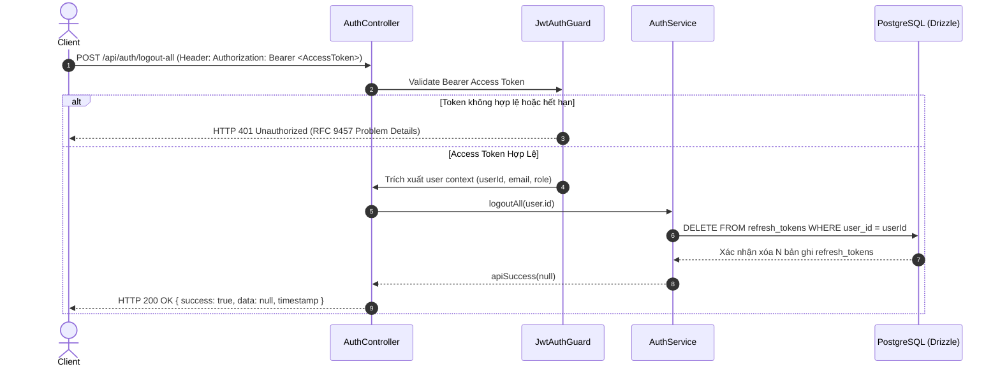

# Phân Tích & Thiết Kế Workflow: Thu Hồi Toàn Bộ Phiên Đăng Nhập (Logout All User Sessions Flow)

**Trạng thái**: ✅ Implemented
**Module**: `src/modules/auth`  
**Route/Endpoint**: `POST /api/auth/logout-all`  
**Security**: `JwtAuthGuard` (`@ApiBearerAuth()`)  
**Issue Liên Quan**: [#23 - feat(auth): implement revoke all user sessions endpoint](https://github.com/ngxccc/ticket-booking/issues/23)

---

## 1. Sơ Đồ Phân Rã Chức Năng (Work Breakdown Structure - WBS)

| Mã WBS    | Thành Phần / Chức Năng          | Phân Cấp (Level)  | Mô Tả Chi Tiết / Nhiệm Vụ                                       | Output / Artifact                     |
| :-------- | :------------------------------ | :---------------- | :-------------------------------------------------------------- | :------------------------------------ |
| **1.0**   | **Auth Module**                 | **L1: Module**    | Quản lý xác thực, phân quyền và quản lý phiên đăng nhập         | `src/modules/auth`                    |
| **1.1**   | **Logout All Sessions Feature** | **L2: Component** | Thu hồi toàn bộ phiên làm việc (Refresh Tokens) của người dùng  | `POST /api/auth/logout-all`           |
| **1.1.1** | **Guard & User Extraction**     | **L3: Logic**     | Xác thực JWT Access Token & Trích xuất thông tin người dùng     | `src/common/guards/jwt-auth.guard.ts` |
| 1.1.1.1   | Bearer Token Verification       | L4: Execution     | Verify JWT signature, expiration & active status                | `@UseGuards(JwtAuthGuard)`            |
| 1.1.1.2   | Current User Decorator          | L4: Execution     | Inject `user` payload (`userId`, `email`, `role`) vào Request   | `@CurrentUser()` decorator            |
| **1.1.2** | **Business Service & DB Purge** | **L3: Logic**     | Thực thi xóa sạch toàn bộ Refresh Token của User trong Database | `src/modules/auth/auth.service.ts`    |
| 1.1.2.1   | Bulk Token Deletion Query       | L4: Execution     | Chạy `DELETE FROM refresh_tokens WHERE user_id = :userId`       | `refreshTokens` schema (Drizzle ORM)  |
| 1.1.2.2   | Standard API Response Mapping   | L4: Execution     | Trả về kết quả `ApiResponse<null>` chuẩn định dạng              | `apiSuccess(null)` (`200 OK`)         |

---

## 2. Sơ Đồ Luồng Tuần Tự (Sequence Diagram)



---

## 3. Quyết Định Kiến Trúc & Thiết Kế Kỹ Thuật (Tech Decisions)

### 3.1 Route Constants & Mapping

Thêm hằng số route mới vào `AUTH_ROUTES` để đảm bảo Single Source of Truth:

```typescript
// src/modules/auth/auth.routes.ts
export const AUTH_ROUTES = {
  BASE: "auth",
  // ... existing routes
  LOGOUT: "logout",
  LOGOUT_ALL: "logout-all",
} as const;
```

### 3.2 Security Guard & Controller Endpoint

Endpoint yêu cầu phải đăng nhập thành công (sử dụng Access Token còn hạn). Sử dụng `@UseGuards(JwtAuthGuard)` và `@CurrentUser()` để lấy `userId` an toàn từ token payload:

```typescript
// src/modules/auth/auth.controller.ts
@UseGuards(JwtAuthGuard)
@Post(AUTH_ROUTES.LOGOUT_ALL)
@HttpCode(HttpStatus.OK)
@ApiBearerAuth()
@ApiOkResponseGeneric({
  description: "All user active sessions (refresh tokens) revoked successfully",
})
@ApiUnauthorizedResponseRfc9457()
async logoutAll(
  @CurrentUser("sub") userId: string,
): Promise<ApiResponse<null>> {
  return this.authService.logoutAll(userId);
}
```

### 3.3 Service Logic & Bulk Token Revocation

Thu hồi tất cả refresh tokens của người dùng thông qua truy vấn xóa hàng loạt:

```typescript
// src/modules/auth/auth.service.ts
async logoutAll(userId: string): Promise<ApiResponse<null>> {
  await this.db
    .delete(refreshTokens)
    .where(eq(refreshTokens.userId, userId));

  return apiSuccess(null);
}
```

---

## 4. Chiến Lược Bảo Vệ Nhiều Lớp (Defense-in-Depth & Security)

- **Lớp 1: Throttler Guard (Rate-Limiting)**: Bảo vệ endpoint khỏi tần suất gọi quá lớn (Anti-Abuse/Anti-DDoS).
- **Lớp 2: Authentication Guard (`JwtAuthGuard`)**: Đảm bảo chỉ có người dùng đã được xác thực hợp lệ mới có thể gọi endpoint.
- **Lớp 3: User Context Isolation**: Lấy `userId` trực tiếp từ JWT payload đã qua kiểm tra chữ ký HMAC/RSA, ngăn chặn việc người dùng này xóa phiên của người dùng khác.
- **Lớp 4: Complete Session Purge**: Xóa toàn bộ bản ghi `refresh_tokens` liên kết với `userId`, buộc tất cả thiết bị/trình duyệt đang sử dụng refresh token của tài khoản đó phải đăng nhập lại khi Access Token hiện tại hết hạn.

---

## 5. Kế Hoạch Triển Khai (Implementation Checklist)

- [ ] **Bước 1**: Cập nhật `AUTH_ROUTES` trong `src/modules/auth/auth.routes.ts` với hằng số `LOGOUT_ALL: "logout-all"`.
- [ ] **Bước 2**: Viết phương thức `logoutAll(userId: string)` trong `AuthService` (`src/modules/auth/auth.service.ts`).
- [ ] **Bước 3**: Thêm handler `@Post(AUTH_ROUTES.LOGOUT_ALL)` trong `AuthController` (`src/modules/auth/auth.controller.ts`) sử dụng `JwtAuthGuard` và `@CurrentUser("sub")`.
- [ ] **Bước 4**: Viết Unit Tests cho `AuthService.logoutAll` và `AuthController.logoutAll` trong `auth.service.spec.ts` và `auth.controller.spec.ts`.
- [ ] **Bước 5**: Kiểm tra type check (`bun run check-types`) và linter (`bun run lint`).

---

## 6. Tài Liệu Liên Quan

- [[Workflow_Documentation_Standard]]
- [[Logout_User_Workflow]]
- [[Login_User_Workflow]]
- [[Refresh_Token_Separation_Strategy]]
