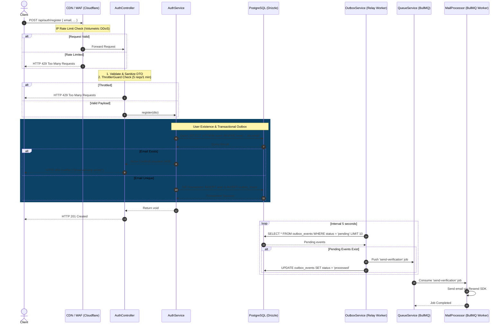

# Phân Tích & Thiết Kế Workflow: Đăng ký Người dùng (Register Flow)

**Trạng thái**: ✅ Implemented  
**Module**: `src/modules/auth`  
**Route/Endpoint**: `POST /api/auth/register`

---

## 1. Sơ Đồ Phân Rã Chức Năng (Work Breakdown Structure - WBS)

| Mã WBS    | Thành Phần / Chức Năng      | Phân Cấp (Level) | Mô Tả Chi Tiết / Nhiệm Vụ                               | Output / Artifact                         |
| :-------- | :-------------------------- | :--------------- | :------------------------------------------------------ | :---------------------------------------- |
| **1.0**   | **Auth Module**             | **L1: Module**   | Quản lý xác thực và phân quyền tài khoản                | `src/modules/auth`                        |
| **1.1**   | **Register Feature**        | **L2: Feature**  | Chức năng đăng ký tài khoản mới                         | `POST /api/auth/register`                 |
| **1.1.1** | **Input DTO & Sanitize**    | **L3: Logic**    | Sanitize XSS & Validate DTO payload                     | `RegisterDto`                             |
| 1.1.1.1   | Sanitize Inputs             | L4: Execution    | Sanitize HTML/CSS trên name, email                      | `src/common/utils/sanitize.util.ts`       |
| 1.1.1.2   | DTO Field Validation        | L4: Execution    | Validate Email format, password, phone                  | `src/modules/auth/dto/register.dto.ts`    |
| **1.1.2** | **User Existence & Crypto** | **L3: Logic**    | Check trùng email & mã hóa mật khẩu                     | `AuthService.register()`                  |
| 1.1.2.1   | Check Email Uniqueness      | L4: Execution    | Query `SELECT id FROM users WHERE email` ($O(1)$)       | DB Index `users_email_uidx`               |
| 1.1.2.2   | Password Hashing            | L4: Execution    | Hash mật khẩu bằng Node.js `crypto.scrypt`              | `src/common/utils/crypto.util.ts`         |
| **1.1.3** | **Data Layer & DB Write**   | **L3: Logic**    | Transaction chèn user & outbox event                    | `src/database/schemas`                    |
| 1.1.3.1   | Single DB Insert            | L4: Execution    | Insert user với `status="pending_verification"`         | `src/database/schemas/auth.schema.ts`     |
| 1.1.3.2   | Transactional Outbox        | L4: Execution    | Insert outbox event `auth.verification_email_requested` | `src/database/schemas/payments.schema.ts` |
| **1.1.4** | **Notification & Queue**    | **L3: Logic**    | Relay Worker đẩy job vào BullMQ Queue                   | `OutboxService` & `BullMQ`                |
| 1.1.4.1   | Outbox Relay Worker         | L4: Execution    | Quét `outbox_events` định kỳ 5s đẩy sang BullMQ         | `src/modules/outbox/outbox.service.ts`    |
| 1.1.4.2   | Mail Processor              | L4: Execution    | Consuming BullMQ job gửi email qua Resend SDK           | `src/modules/mail/mail.processor.ts`      |

---

## 2. Sơ đồ Workflow Đăng Ký Người Dùng (Sequence Diagram)

Dưới đây là sơ đồ tuần tự xử lý yêu cầu đăng ký người dùng:

---

## 3. Quyết Định Kiến Trúc & Thiết Kế Kỹ Thuật (Tech Decisions)

### 3.1 Cấu Hình Schema & Migration Strategy

1. **Trạng thái `"pending_verification"`**: Cột `status` bảng `users` sử dụng enum `user_status` với giá trị mặc định là `"pending_verification"`.
2. **Partial Index Tối Ưu**: Sử dụng Partial Index `CREATE INDEX users_verification_expires_at_idx ON users (verification_expires_at) WHERE status = 'pending_verification'` giúp giảm kích thước index xuống mức tối thiểu.
3. **UUIDv7 Tự Động**: Tạo khóa chính bằng `$defaultFn(uuidv7)` ở schema layer.

### 3.2 Transactional Outbox Pattern

Tạo User và ghi bản ghi sự kiện `auth.verification_email_requested` vào bảng `outbox_events` nằm trong cùng **1 Database Transaction duy nhất** để triệt tiêu bài toán Dual-Write Problem.

---

## 4. Chiến Lược Bảo Vệ Nhiều Lớp (Defense-in-Depth & Security)

- **Lớp 1: CDN / Reverse Proxy**: Chặn DDoS băng thông toàn cục.
- **Lớp 2: Application Level Throttling**: Chặn 5 requests/phút per IP thông qua `ThrottlerGuard` + Redis. Ngăn ngừa **Account Pre-emption DoS** bằng cách không khóa cứng theo Email.
- **Lớp 3: Progressive Friction**: Tự động hiển thị CAPTCHA (Cloudflare Turnstile) và áp dụng Exponential Backoff khi phát hiện dấu hiệu spam.

---

## 5. Kế Hoạch Triển Khai (Implementation Checklist)

- [x] **DB Migration**: Thêm enum `"pending_verification"`, cột `verificationToken`, `verificationExpiresAt` và chạy `db:migrate`.
- [x] **AuthService Logic**: Kiểm tra email trùng ($O(1)$), scrypt password hashing, DB transaction outbox insert.
- [x] **DTO & Validation**: Viết `RegisterDto` với sanitize XSS decorator và `@Match("password")`.
- [x] **Rate Limiting**: Cấu hình `@nestjs/throttler` 5 reqs/1 min per IP.
- [x] **Unit & Integration Tests**: Kiểm thử thành công, 409 Conflict, và 400 Validation failure.

---

## 6. Tài Liệu Liên Quan

- [[Workflow_Documentation_Standard]]
- [[Guards_and_CanActivate_Deep_Dive]]
- [[PostgreSQL_Locking_and_Concurrency_Deep_Dive]]
