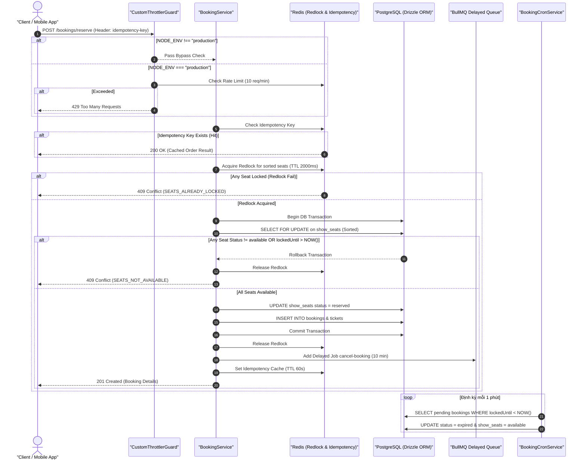

# Hồ Sơ Vận Hành Core Booking & Concurrency Control (SSOT Operational Workflow)

## 1. TL;DR & Phạm Vi Vận Hành (Operational Scope & Boundaries)

Tài liệu này là **Nguồn Sự Thật Duy Nhất (Single Source of Truth - SSOT)** mô tả luồng vận hành và xử lý đồng thời cao của module Booking (`src/modules/booking/`).

### 1.1 Quản Lý Trạng Thái & Quy Trình Lấy Khóa

- **Lớp 1 (RAM Distributed Lock - Redlock)**: Sử dụng Redis key `lock:show_seat:<seatId>` với TTL 2000ms để chặn tranh chấp siêu tốc ngay từ tầng bộ nhớ.
- **Lớp 2 (Database Pessimistic Lock - PostgreSQL `FOR UPDATE`)**: Thực thi trong DB Transaction với thứ tự khóa được sắp xếp tăng dần từ `[...dto.seatIds].sort()` nhằm triệt tiêu hoàn toàn **Circular Wait (Deadlock)**.
- **Vùng Đệm Idempotency**: Redis key `idempotency:booking:<userId>:<key>` với TTL 60 giây.
- **Tự Chữa Lành (Self-Healing)**: `BookingCronService` tự động dọn dẹp các đơn đặt vé quá hạn `lockedUntil` (> 10 phút) và trả ghế về trạng thái `available`.

---

## 2. Bảng Phân Tách Công Việc 4 Cấp (4-Level WBS Table)

| Level 1 (Epic)      | Level 2 (Subsystem)     | Level 3 (Component/Task)   | Level 4 (Technical Implementation & Boundary)                                            |
| :------------------ | :---------------------- | :------------------------- | :--------------------------------------------------------------------------------------- |
| **1. Core Booking** | 1.1 DTO & Validation    | 1.1.1 ReserveSeatsDto      | Kiểm tra `@IsUUID("7")`, `@ArrayMinSize(1)`, `@ArrayMaxSize(6)`                          |
|                     | 1.2 Rate Limiting       | 1.2.1 CustomThrottlerGuard | Bỏ qua ở Dev/Test (`NODE_ENV !== "production"`), bảo vệ 10 req/min ở Prod với timeout 2s |
|                     | 1.3 Concurrency Control | 1.3.1 Seat Sorting         | `[...dto.seatIds].sort()` đảm bảo thứ tự từ điển đồng nhất                               |
|                     |                         | 1.3.2 Redlock RAM Layer    | Khóa nguyên tử `lock:show_seat:<id>`, TTL 2000ms                                         |
|                     |                         | 1.3.3 DB Pessimistic Lock  | Transaction `SELECT ... FOR UPDATE` trên bảng `show_seats`                               |
|                     | 1.4 Background Queue    | 1.4.1 BullMQ Integration   | Đẩy delayed job 10 phút để tự động hủy đơn hết hạn                                       |
|                     | 1.5 Cron Cleanup        | 1.5.1 BookingCronService   | Quét và hủy các `booking` kẹt ở `pending` có `lockedUntil < NOW()`                       |

---

## 3. Sơ Đồ Luồng Vận Hành bằng Mermaid (Sequence Diagram)

---

## 4. Xác Nhận Kiểm Định & Quality Gate (Verification Evidence)

- **Unit Test Suite (`bun test src/`)**: 140 Pass / 0 Fail (100% Green).
- **Integration High-Concurrency Suite (`bun test test/integration/booking.spec.ts`)**: 43 Pass / 1 Skip / 0 Fail (Mục 7.1 Deadlock, 7.2 Idempotency Race, 7.3 Cron Cleanup verified).
- **TypeScript Typecheck (`bun run check-types`)**: 0 errors.
- **Linter (`bun run lint`)**: 0 errors.
