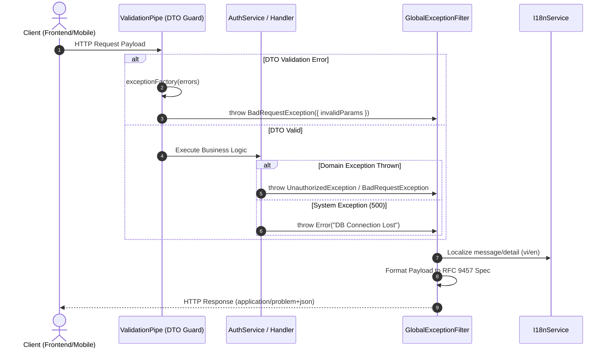

# GlobalExceptionFilter Implementation & Workflow Audit Guide

**Trạng thái**: ✅ Approved  
**Phạm vi**: Cross-cutting / Global Error Handling Infrastructure  
**Vị trí mã nguồn**: `src/common/filters/global-exception.filter.ts`  
**Chuẩn tuân thủ**: [[RFC_9457_Problem_Details_Deep_Dive]]  

---

## 1. Executive Summary & Architecture Goal

Sự lệch định dạng giữa lỗi DTO (`ValidationPipe` trả về mảng `constraints`) và lỗi nghiệp vụ (`AuthService` trả về chuỗi `message`) khiến Frontend/Mobile App phải viết nhiều cờ xử lý phức tạp.

Mục tiêu kiến trúc của **`GlobalExceptionFilter`**:
1. Chuẩn hóa 100% mọi ngoại lệ (từ DTO Validation, Auth Service, Database, đến Unhandled Errors) về cùng 1 cấu trúc JSON tuân thủ **RFC 9457**.
2. Thiết lập Header `Content-Type: application/problem+json`.
3. Che giấu chi tiết nhạy cảm (Stack Traces, SQL Errors) ở môi trường Production.

---

## 1.1. Sơ Đồ Phân Rã Chức Năng (Work Breakdown Structure - WBS)

| Mã WBS | Thành Phần / Chức Năng | Phân Cấp (Level) | Mô Tả Chi Tiết / Nhiệm Vụ | Output / Artifact |
| :--- | :--- | :--- | :--- | :--- |
| **1.0** | **Global Exception Infrastructure** | **L1: Module** | Xử lý & chuẩn hóa ngoại lệ toàn hệ thống theo RFC 9457 | `src/common/filters` |
| **1.1** | **Filter & Validation Component** | **L2: Component** | Bộ lọc ngoại lệ toàn cục & DTO Error Flattening | `GlobalExceptionFilter` |
| **1.1.1** | **Core Filter Implementation** | **L3: Logic** | Bắt `HttpException` / `Error`, set header `application/problem+json` | `src/common/filters/global-exception.filter.ts` |
| 1.1.1.1 | Unit Test Suite | L4: Execution | Kiểm thử logic 400, 401, 500 với mocked host | `src/common/filters/global-exception.filter.spec.ts` |
| **1.1.2** | **App Bootstrap Integration** | **L3: Logic** | Đăng ký `ValidationPipe.exceptionFactory` & filter toàn cục | `src/main.ts` & `test/helpers/app.helper.ts` |
| 1.1.2.1 | E2E Integration Suite | L4: Execution | Supertest gửi HTTP request thật kiểm thử pipeline | `test/global-exception.e2e-spec.ts` |

---

## 2. Operational & Exception Sequence Diagram

Dưới đây là sơ đồ luồng vận hành xử lý ngoại lệ toàn bộ ứng dụng:



---

## 3. Detailed Implementation Blueprint

### Step 1: Cấu Hình `exceptionFactory` Cho `ValidationPipe` (`src/main.ts`)

`ValidationPipe` được cấu hình để chuyển đổi mảng `ValidationError` lồng nhau thành mảng phẳng `invalidParams` chuẩn RFC 9457:

```typescript
app.useGlobalPipes(
  new ValidationPipe({
    whitelist: true,
    transform: true,
    exceptionFactory: (errors: ValidationError[]) => {
      const invalidParams = errors.map((err) => {
        const firstConstraintKey = Object.keys(err.constraints || {})[0];
        return {
          name: err.property,
          reason: firstConstraintKey
            ? err.constraints?.[firstConstraintKey]
            : "Invalid property",
        };
      });

      return new BadRequestException({
        detail: "Dữ liệu gửi lên không đúng định dạng",
        invalidParams,
      });
    },
  }),
);
```

---

### Step 2: Xây Dựng `GlobalExceptionFilter` (`src/common/filters/global-exception.filter.ts`)

```typescript
import {
  type ArgumentsHost,
  Catch,
  type ExceptionFilter,
  HttpException,
  HttpStatus,
  Logger,
} from "@nestjs/common";
import type { Request, Response } from "express";

@Catch()
export class GlobalExceptionFilter implements ExceptionFilter {
  private readonly logger = new Logger(GlobalExceptionFilter.name);

  catch(exception: unknown, host: ArgumentsHost): void {
    const ctx = host.switchToHttp();
    const response = ctx.getResponse<Response>();
    const request = ctx.getRequest<Request>();

    let status = HttpStatus.INTERNAL_SERVER_ERROR;
    let title = "Internal Server Error";
    let detail = "Đã xảy ra lỗi hệ thống. Vui lòng thử lại sau.";
    let invalidParams: Array<{ name: string; reason: string }> = [];

    if (exception instanceof HttpException) {
      status = exception.getStatus();
      title = exception.name.replace(/Exception$/, "");
      const res = exception.getResponse();

      if (typeof res === "string") {
        detail = res;
      } else if (typeof res === "object" && res !== null) {
        const resObj = res as Record<string, unknown>;
        detail = (resObj["detail"] as string) || (resObj["message"] as string) || detail;
        if (Array.isArray(resObj["invalidParams"])) {
          invalidParams = resObj["invalidParams"];
        }
      }
    } else {
      this.logger.error(
        `Unhandled Exception: ${exception instanceof Error ? exception.stack : String(exception)}`,
      );
    }

    const hostUrl = `${request.protocol}://${request.get("host") || "localhost"}`;
    const typeUri = `${hostUrl}/errors/${title.toLowerCase().replace(/\s+/g, "-")}`;

    response
      .status(status)
      .setHeader("Content-Type", "application/problem+json")
      .json({
        type: typeUri,
        title,
        status,
        detail,
        instance: request.url,
        invalidParams,
        timestamp: new Date().toISOString(),
      });
  }
}
```

---

## 4. Security & Data Leak Safeguards

- **Stack Trace Sanitization**: Log chi tiết stack trace vào internal Logger (`Logger.error`), tuyệt đối không gửi về phía Client trong HTTP Response.
- **Database Query Shielding**: Mọi ngoại lệ từ Drizzle ORM / PostgreSQL Driver (mã 500) được bọc lại thành câu thông báo chung `"Đã xảy ra lỗi hệ thống. Vui lòng thử lại sau."` để tránh rò rỉ cấu trúc bảng và câu lệnh SQL.
- **Header Protocol Enforcement**: Đảm bảo Header `Content-Type: application/problem+json` luôn được thiết lập chính xác cho mọi ngoại lệ.

---

## 5. Audit & Verification Checklist

- [ ] **Header Protocol Check**: Response trả về có chứa Header `Content-Type: application/problem+json` hay không.
- [ ] **DTO Validation Error Parity**: Kiểm tra route `POST /api/auth/register` khi gửi sai DTO, xem `invalidParams` có dạng `[{ name, reason }]` phẳng hay không.
- [ ] **Domain Exception Parity**: Kiểm tra route `POST /api/auth/change-password` khi gửi sai mật khẩu cũ, xem `detail` có chứa câu thông báo lỗi 401 hay không.
- [ ] **Status Code Fidelity**: Đảm bảo mã HTTP Status Code trong Body (`status`) trùng khớp 100% với HTTP Header Code.
- [ ] **Path Fidelity**: Đảm bảo trường `instance` khớp với endpoint được gọi (`/api/auth/change-password`).
- [ ] **Security Leak Audit**: Môi trường Production (`NODE_ENV=production`) tuyệt đối không được rò rỉ `stack trace` hoặc thông báo lỗi SQL thô trong trường `detail`.
- [ ] **E2E Integration Test Verification**: Chạy `bun test test/global-exception.e2e-spec.ts` kiểm thử toàn bộ Pipeline HTTP Server thật (`Supertest` gửi request tới endpoint DTO sai và Domain exception).

---

## 6. Tài Liệu Liên Quan
- [[Workflow_Documentation_Standard]]
- [[RFC_9457_Problem_Details_Deep_Dive]]
- [[Guards_and_CanActivate_Deep_Dive]]
