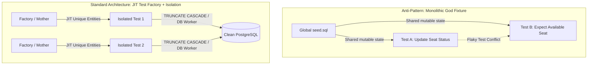
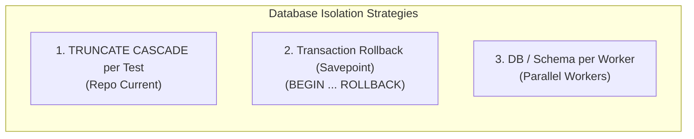

# Database Integration Testing & Data Seeding Architecture

## TL;DR [BẮT BUỘC]

- **Bản chất**: Kiến trúc phân tầng và quản lý vòng đời dữ liệu kiểm thử (Test Data Management), thay thế việc gọi raw insert thủ công rải rác bằng các **Test Data Factories** (tự động resolve DAG quan hệ & sinh giá trị hợp lệ ngẫu nhiên) và **Object Mothers** (tập hợp các biến thể nghiệp vụ chuẩn).
- **Mục đích & Bài toán**: Xóa bỏ hoàn toàn hiện tượng flaky test, test interdependence ("spooky action at a distance"), mystery guest và hàng trăm dòng boilerplate seed dữ liệu quan hệ (Movies $\rightarrow$ Cinemas $\rightarrow$ Halls $\rightarrow$ Seats $\rightarrow$ Shows $\rightarrow$ Bookings).
- **Điểm mấu chốt**: Phân tách triệt để **Static Reference Data** (seed 1 lần cho toàn suite) và **Dynamic Operational Data** (khởi tạo JIT per-test qua Factory), kết hợp dọn dẹp state per-test (`TRUNCATE ... CASCADE` hoặc `Database-per-Worker`).

---

## Core Concept [BẮT BUỘC]

### 1. Tại sao nó tồn tại & Giải quyết bài toán gì?

Trong các bài test tích hợp (Integration Test / E2E Test) tương tác trực tiếp với Database quan hệ (PostgreSQL + Drizzle ORM), việc thiết lập trạng thái ban đầu (Arrange step) gặp phải 3 vấn đề nhức nhối:

1. **Relational DAG Overhead (Đồ thị phụ thuộc quan hệ)**:
   Để test một logic đơn giản của `Show`, lập trình viên phải insert lần lượt `Movie` $\rightarrow$ `Cinema` $\rightarrow$ `Hall` $\rightarrow$ `SeatType` $\rightarrow$ `Seats` $\rightarrow$ `Show` $\rightarrow$ `ShowSeats`. Đoạn code setup này chiếm 60–80 dòng trong mỗi file test, lặp đi lặp lại ở mọi nơi.
2. **Mystery Guest Anti-Pattern**:
   Người đọc test case không thể phân biệt được đâu là dữ liệu cốt lõi phục vụ assertion của test case, đâu chỉ là dữ liệu "mồi" để thỏa mãn Foreign Key.
3. **Flaky Tests do Data Pollution**:
   Dùng chung 1 monolithic fixture (`seed.sql`) nạp sẵn dữ liệu cố định khiến các test phụ thuộc lẫn nhau, thứ tự chạy test thay đổi hoặc chạy song song sẽ gây xung đột dữ liệu.



---

### 2. So sánh các phương pháp tiếp cận Seed Data

| Tiêu chí                          | Raw Inserts trong Test (Hiện tại) | Monolithic God Fixture (`seed.sql`)  | Test Data Factory Pattern                 | Object Mother Pattern             |
| :-------------------------------- | :-------------------------------- | :----------------------------------- | :---------------------------------------- | :-------------------------------- |
| **Tính độc lập của Test**         | Cao (nếu có truncate)             | **Rất thấp** (chia sẻ state mutable) | **Tuyệt đối** (mỗi test tự sinh data)     | **Tuyệt đối**                     |
| **Boilerplate Code**              | Rất nhiều (lặp 50-100 dòng/file)  | Thấp (chỉ chạy 1 lần)                | Rất thấp (`createShow({...})`)            | Rất thấp (`ShowMother.soldOut()`) |
| **Khả năng Override**             | Thủ công từng property            | Không thể                            | Linh hoạt qua `Partial<T>`                | Cố định theo kịch bản chuẩn       |
| **Tự động resolve FK**            | Không (phải insert tay từng tầng) | Đã hardcode sẵn                      | **Tự động** (nếu thiếu FK tự sinh parent) | **Tự động**                       |
| **Tốc độ bảo trì khi đổi Schema** | Phải sửa hàng chục file test      | Sửa file SQL lớn                     | **Chỉ sửa 1 nơi duy nhất tại Factory**    | Sửa tại Factory/Mother            |

---

### 3. Core Mechanics: Tầng Dữ Liệu & Chiến Lược Database Isolation

#### A. Phân tầng dữ liệu (Data Stratification)

1. **Static Reference Data** (Seed 1 lần tại `globalSetup` / `beforeAll`):
   - Bảng danh mục ít thay đổi: `roles`, `permissions`, `genres`, `currency_rates`, `country_codes`.
   - Bất biến (Immutable) trong suốt quá trình test chạy.
2. **Dynamic Operational Data** (Khởi tạo JIT per-test qua Factory):
   - Bảng giao dịch biến động: `users`, `cinemas`, `halls`, `shows`, `bookings`, `tickets`.
   - Vòng đời chỉ tồn tại trong đúng 1 test case (`it()` block).

#### B. Chiến lược Database Isolation



- **TRUNCATE per test (`test/helpers/database.helper.ts`)**:
  - Dọn sạch toàn bộ bảng trong database sau/trước mỗi test case.
  - Phù hợp nhất cho hệ thống kiểm thử Distributed Lock (Redlock), Concurrency và Outbox Worker vì không bị giới hạn trong 1 transaction session đơn lẻ.
- **Transaction Rollback**:
  - Mở transaction ở `beforeEach`, rollback ở `afterEach`. Rất nhanh nhưng **không áp dụng được** khi SUT gọi `db.transaction()` bên trong hoặc có background worker bất đồng bộ truy cập DB từ connection khác.

---

## Practical Implementation [BẮT BUỘC]

### 1. Kiến trúc Test Factory trên Drizzle ORM

Factory chịu trách nhiệm:

1. Sinh default attributes hợp lệ với UUID/Faker ngẫu nhiên.
2. Tự động kiểm tra và gọi Factory cấp cha nếu Foreign Key không được truyền vào.

```ts
// test/factories/movie.factory.ts
import { db } from "@/database";
import { movies, type NewMovie, type Movie } from "@/database/schemas";

export async function createMovie(
  overrides: Partial<NewMovie> = {},
): Promise<Movie> {
  const [movie] = await db
    .insert(movies)
    .values({
      durationMinutes: 120,
      rating: "PG",
      releaseDate: "2026-01-01",
      posterUrl: "https://example.com/poster.jpg",
      ...overrides,
    })
    .returning();

  if (!movie) throw new Error("Failed to create Movie fixture");
  return movie;
}
```

```ts
// test/factories/cinema.factory.ts
import { db } from "@/database";
import {
  cinemas,
  halls,
  type Cinema,
  type Hall,
  type NewCinema,
  type NewHall,
} from "@/database/schemas";

export async function createCinema(
  overrides: Partial<NewCinema> = {},
): Promise<Cinema> {
  const [cinema] = await db
    .insert(cinemas)
    .values({
      name: `Cinema-${crypto.randomUUID().slice(0, 8)}`,
      address: "720A Dien Bien Phu",
      ...overrides,
    })
    .returning();

  if (!cinema) throw new Error("Failed to create Cinema fixture");
  return cinema;
}

export async function createHall(
  overrides: Partial<NewHall> = {},
): Promise<Hall> {
  const cinemaId = overrides.cinemaId ?? (await createCinema()).id;

  const [hall] = await db
    .insert(halls)
    .values({
      cinemaId,
      name: `Hall-${crypto.randomUUID().slice(0, 8)}`,
      totalSeats: 100,
      ...overrides,
    })
    .returning();

  if (!hall) throw new Error("Failed to create Hall fixture");
  return hall;
}
```

---

### 2. Triển khai Object Mother Pattern cho các kịch bản chuẩn

```ts
// test/mothers/movie.mother.ts
import { createMovie } from "../factories/movie.factory";

export class MovieMother {
  static standard() {
    return createMovie({ durationMinutes: 120, rating: "PG" });
  }

  static blockbusterLong() {
    return createMovie({ durationMinutes: 300, rating: "PG" });
  }

  static animationShort() {
    return createMovie({ durationMinutes: 30, rating: "G" });
  }
}
```

---

### 3. Minh họa chuyển đổi Test Case trước và sau Refactor

#### Trước Refactor (Boilerplate 60+ dòng):

```ts
// Phải insert từng tầng thủ công
const [movie] = await db.insert(movies).values({...}).returning();
const [cinema] = await db.insert(cinemas).values({...}).returning();
const [hall] = await db.insert(halls).values({ cinemaId: cinema.id, ... }).returning();
const [show] = await db.insert(shows).values({ movieId: movie.id, hallId: hall.id, ... }).returning();
```

#### Sau Refactor (Rõ ràng, trực quan, 3 dòng):

```ts
it("should reject show creation when time overlaps with existing show", async () => {
  const hall = await createHall();
  const existingShow = await ShowMother.morningSlot(hall.id);

  // SUT Execution
  const response = await request(app).post("/shows").send({
    hallId: hall.id,
    startTime: existingShow.startTime,
    // ...
  });

  expect(response.status).toBe(409);
});
```

---

## Trade-offs

- **Chi phí triển khai ban đầu**: Phải xây dựng và duy trì bộ Factory đồng bộ với Drizzle Schema khi entity thay đổi.
- **Over-abstraction Risk**: Tránh viết factory quá phức tạp với hàng chục option lồng nhau. Mỗi factory chỉ nên giải quyết việc tạo 1 entity và liên kết cha trực tiếp.

---

**Related Notes:**

- [[PostgreSQL_Locking_and_Concurrency_Deep_Dive]]
- [[Database_Entities_and_Connection_Testing]]
- [[Drizzle_v1_RC4_Coding_Standards]]
- [[000_Ticket_Booking_MOC]]
