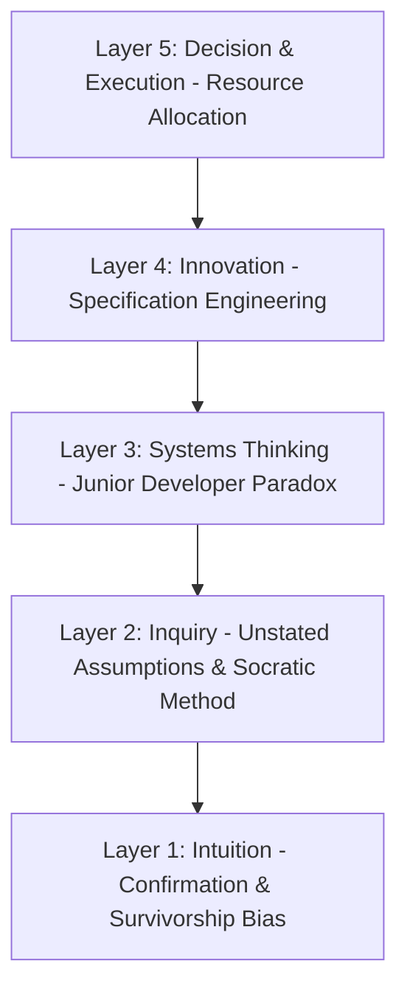
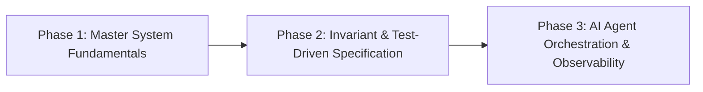

---
tags:
  [
    type/concept,
    topic/psychology,
    topic/learning,
    topic/career,
    topic/engineering,
  ]
date: 2026-08-12
aliases:
  [
    RMIT Critical Review Report AI Coding 2026,
    Báo cáo phản biện bài viết daily.dev,
    Academic Critical Review Report Standard,
  ]
description: "Báo cáo phản biện chuẩn học thuật RMIT áp dụng Cognitive Stack Framework để đánh giá bài viết Should You Still Learn to Code in 2026 trên daily.dev."
---

# Critical Review Report: Should You Still Learn to Code in 2026?

## TL;DR

Báo cáo phản biện theo chuẩn học thuật RMIT Academic Critical Review Report phân tích toàn diện bài viết "Should you still learn to code in 2026? The honest answer" công bố trên daily.dev. Báo cáo ứng dụng [[Cognitive_Stack_Framework]] để bóc tách 5 tầng nhận thức, vạch rõ các điểm mù về Cognitive Biases, Unstated Assumptions, và Second-Order System Paradox. Báo cáo đồng thời đề xuất khung hành động chiến lược giúp lập trình viên phát triển năng lực cạnh tranh cốt lõi trong kỷ nguyên AI.

---

## Academic Critical Review Framework

Báo cáo này được cấu trúc theo định dạng RMIT Academic Analytical Evaluation Report, bao gồm các phần chuẩn mực:

1. **Executive Summary & Context**: Xác định tác phẩm, mục tiêu nghiên cứu và luận điểm trung tâm.
2. **Summary of Target Text**: Tóm tắt khách quan các luận điểm và số liệu chính của nguồn phân tích.
3. **Critical Evaluation via Cognitive Stack**: Phân tích phản biện theo 5 tầng nhận thức của Cognitive Stack Framework.
4. **Synthesis of Limitations & System Paradoxes**: Đánh giá tổng hợp điểm mạnh, hạn chế và nghịch lý cấu trúc.
5. **Strategic Recommendations**: Đề xuất lộ trình hành động có tính ứng dụng cao cho người học.
6. **Academic References**: Danh mục tài liệu tham khảo theo chuẩn trích dẫn.

---

## 1. Executive Summary & Context

- **Tên tác phẩm phân tích:** _Should you still learn to code in 2026? The honest answer_
- **Nguồn công bố:** daily.dev Blog (Tháng 8, 2026)
- **Tác giả:** Đội ngũ biên tập daily.dev (dẫn nguồn Ali Jabbary, Eric Simons)
- **Ngữ cảnh nghiên cứu:** Sự bùng nổ của các công cụ AI Coding và Agentic Workflows khiến cộng đồng phát triển phần mềm hoài nghi về giá trị của việc học lập trình truyền thống.
- **Luận điểm trung tâm của bài viết:** Vẫn nên học lập trình năm 2026, nhưng mục tiêu phải chuyển dịch từ Typing Speed / Syntax Memorization sang Code Reading, Debugging, System Design, Risk Checking và Technical Judgment.
- **Luận điểm phản biện của báo cáo này:** Mặc dù bài viết đưa ra định hướng chuyển dịch hợp lý ở bề nổi, phân tích chuyên sâu cho thấy bài viết mắc phải nhiều thiên kiến nhận thức, đưa ra giả định ngầm thiếu căn cứ về phương pháp xây dựng Mental Model, và hoàn toàn bỏ qua nghịch lý đào tạo Junior Developer trong hệ thống tuyển dụng thực tế.

---

## 2. Summary of Target Text Key Claims

Tác giả bài viết trên daily.dev bảo vệ quan điểm thông qua 4 nhóm luận điểm chính:

1. **Phân định ranh giới năng lực AI:**
   - AI vận hành tốt ở các tác vụ hẹp, chuẩn hóa: Boilerplate, CRUD flows, Unit Test drafts, Documentation, API Signatures.
   - AI yếu ở các vùng phức tạp: Edge cases, Security, System Behavior under load, Unclear Business Requirements, Long-term Maintainability.
2. **Các chỉ số thực nghiệm được trích dẫn:**
   - Chỉ **3.1%** lập trình viên tin tưởng hoàn toàn vào code do AI tạo ra.
   - **45.2%** lập trình viên xác nhận việc Debug code do AI tạo ra tốn nhiều thời gian hơn tự viết từ đầu.
   - Nghiên cứu từ METR (2025) chỉ ra lập trình viên sử dụng AI Tools hoàn thành công việc chậm hơn **19%**, mặc dù họ tự cảm thấy nhanh hơn **20%**.
   - Code do AI viết có nguy cơ chứa lỗi cao hơn **1.7 lần** và nguy cơ hổng bảo mật XSS cao hơn **2.74 lần**.
   - Nghiên cứu từ Anthropic (Jan 2026) cho thấy nhóm người dùng AI thụ động đạt **50%** điểm Code Comprehension so với **67%** ở nhóm tự viết code tay.
3. **Sự dịch chuyển vai trò nghề nghiệp:** Lập trình viên chuyển từ vị trí Author sang Auditor.
4. **Phương pháp học tập đề xuất:** Học 1 ngôn ngữ nền tảng, tự gõ code thủ công để hiểu cấu trúc, dự đoán output trước khi chạy AI, và dùng AI để kiểm tra suy nghĩ chứ không thay thế suy nghĩ.

---

## 3. Critical Evaluation via 5-Layer Cognitive Stack

Báo cáo áp dụng [[Cognitive_Stack_Framework]] để tiến hành phản biện đa tầng đối với bài viết.

### 3.1. Layer 1: Intuition & Bias Filtering

Tầng này kiểm tra các bộ lọc nhận thức để đảm bảo phân tích dựa trên dữ liệu khách quan.

- **Confirmation Bias & Audience Appeasement:**
  - Bài viết phát hành trên daily.dev – một Content Aggregator dành riêng cho Developer. Độc giả mục tiêu đang trải qua tâm lý lo âu bị thay thế (AI Anxiety).
  - Kết luận khẳng định "Yes" ngay đầu bài mang tính chất trấn an tâm lý người đọc để duy trì lưu lượng truy cập và sự gắn kết với nền tảng, thay vì đưa ra một phân tích kinh tế lao động trung lập.
- **Survivorship Bias trong Mẫu Nghiên Cứu:**
  - Các nghiên cứu từ METR hay Anthropic được trích dẫn đều thực hiện trên tệp lập trình viên có sẵn kinh nghiệm (experienced developers với trung bình 5 năm kinh nghiệm hoặc lập trình viên đang học thư viện mới) chuyển sang dùng AI làm công cụ hỗ trợ.
  - Tác giả phạm lỗi thiên kiến khi lấy trải nghiệm của những người dùng AI thụ động (Passive AI Users) làm đại diện cho toàn bộ khả năng phát triển năng lực của thế hệ lập trình viên AI-Native tương lai.
- **Sunk Cost Fallacy:**
  - Khuyên người mới phải tự gõ code tay trước như truyền thống thể hiện tư duy ngụy biện chi phí chìm của giới lập trình viên đi trước, bắt buộc thế hệ mới lặp lại quy trình học tập cũ dù các lớp trừu tượng hóa (Abstraction Layers) đã thay đổi.

### 3.2. Layer 2: Inquiry & First Principles Deconstruction

Sử dụng [[First_Principles_Thinking]] và [[Socratic_Questioning_Method]] để bóc tách các giả định ngầm.

- **Giả định Ngầm 1: "Gõ syntax thủ công là con đường DUY NHẤT tạo ra Code Comprehension."**
  - _Truy vấn:_ Bản chất của Code Comprehension là gì?
  - _Phân tách:_ Năng lực hiểu code xuất phát từ việc nắm bắt State Transitions, Data Flow, Memory Allocation, và System Invariants. Việc gõ lại các cú pháp Boilerplate bằng tay chỉ tạo ra trí nhớ cơ bắp (Muscle Memory), không trực tiếp tạo ra chiều sâu tư duy kiến trúc. Người học hoàn toàn có thể xây dựng Mental Model thông qua Interactive Debugging, Architectural Tracing, và Code Reading có hướng dẫn.
- **Giả định Ngầm 2: "AI chỉ dừng lại ở vai trò Autocomplete / First Draft Generator."**
  - _Truy vấn:_ Khả năng của AI trong kỹ nghệ phần mềm giới hạn ở đâu?
  - _Phân tách:_ Bài viết thu hẹp AI vào mô hình tương tác Chat đơn lẻ. Trong thực tế, sự phát triển của Agentic Workflows (Agent tự chạy Test, tự đọc Log, tự sửa lỗi và tối ưu hóa) đang xóa bỏ ranh giới giữa Drafting và Reviewing.
- **Nghịch lý Human as Auditor:**
  - Trích dẫn Eric Simons chỉ ra: _"Writing software is perhaps a smaller problem now. But what about reviewing? How do we scale this?"_
  - _Phân tách:_ Khả năng review của con người là một tuyến tính (Linear), trong khi tốc độ tạo code của AI là cấp số nhân (Exponential). Khuyên con người làm Auditor đọc từng dòng code AI tạo ra là một giải pháp không thể mở rộng (Unscalable Strategy).

### 3.3. Layer 3: Systems Thinking & Second-Order Effects

Áp dụng [[Systems_Thinking]] và [[Second_Order_Thinking]] để phát hiện các tác động dây chuyền.

- **The Junior Developer Training Paradox:**
  - _Tác động Bậc 1:_ Doanh nghiệp tự động hóa 100% các việc cấp thấp (CRUD, Boilerplate, Unit Tests) bằng AI để tiết kiệm chi phí.
  - _Tác động Bậc 2:_ Doanh nghiệp cắt giảm chỉ tiêu tuyển dụng Junior Developer vì không còn nhu cầu thuê người làm việc tay chân.
  - _Tác động Bậc 3 (Hệ quả hệ thống):_ Junior Developer không có môi trường thực chiến (Training Ground) để va chạm và tích lũy kinh nghiệm. Hệ thống mất đi nguồn cung Senior Developer có đủ Technical Judgment trong tương lai.
  - Bài viết khuyên học để lấy Technical Judgment, nhưng hệ thống tuyển dụng lại đang triệt hạ chính vòng lặp phản hồi tạo ra Judgment đó.
- **Review Fatigue & Cognitive Load:**
  - Việc đọc và kiểm lỗi code do tác nhân khác (AI) tạo ra gây tốn năng lượng nhận thức cao hơn nhiều so với việc tự làm từ đầu do thiếu Cognitive Ownership.
  - Trong dài hạn, hệ thống sẽ phát sinh hiện tượng Review Fatigue: Lập trình viên sẽ duyệt qua loa các Pull Request của AI, khiến rào chắn bảo vệ (Guardrail) bị vô hiệu hóa.

### 3.4. Layer 4: Innovation & Divergent Paradigms

Bài viết đưa ra hướng giải pháp mang tính bảo thủ. Để thích ứng, người học cần một chuyển dịch mô hình (Paradigm Shift).

- **Divergent Shift: Từ Code Reading sang Specification & Invariant Engineering:**
  - Thay vì đào tạo con người thành kiểm toán viên đọc từng dòng cú pháp (Local Optimization), năng lực cốt lõi mới là biểu diễn chính xác yêu cầu nghiệp vụ thành các ràng buộc hệ thống.
  - Con người thiết kế System Invariants (Ví dụ: "Tài khoản không được âm balance trong bất kỳ luồng Concurrency nào"), xây dựng Formal Verification Rules và Integration Test Suites. AI Agent sẽ viết code và tự chứng minh code đó thỏa mãn các Invariants.
- **Shift Left on Architecture:**
  - Xóa bỏ ranh giới giữa Coder và Architect. Người học phải tiếp cận tư duy kiến trúc ngay từ đầu: tập trung vào Data Structure, Distributed State, Rate Limiting, và Security Boundaries.

### 3.5. Layer 5: Strategic Decision & Execution

Ứng dụng [[Opportunity_Cost]] và [[Deliberate_Practice_Framework]] để phân bổ tài nguyên học tập.

- **Opportunity Cost Optimization:**
  - Dành hàng trăm giờ để học thuộc cú pháp và gõ tay các bài toán thuật toán cơ bản có chi phí cơ hội quá cao trong kỷ nguyên AI.
  - Phân bổ lại tài nguyên học tập theo tỷ lệ chiến lược:
    - **30% thời gian - Core Engineering Fundamentals:** Nắm vững Memory Models, Threading/Concurrency, Network Protocols (HTTP/TCP), Database Internals, và 1 ngôn ngữ Strict-type (TypeScript/Go/Rust).
    - **40% thời gian - System Design & Specification:** Học cách thiết kế Data Schema, API Contracts, State Machines, TDD, và System Invariants.
    - **30% thời gian - AI Orchestration & Automated Verification:** Rèn luyện kỹ năng phân rã bài toán cho AI Agents, sử dụng Profiler, Tracing, và Debugger để kiểm định kết quả thay vì đọc bằng mắt thường.

---

## 4. Synthesis of Limitations & System Paradoxes

Bảng tổng hợp đối chiếu giữa luận điểm của bài viết daily.dev và kết quả phân tích phản biện:

| Hạng Mục                | Luận Điểm Bài Viết (daily.dev)                            | Phân Tích Phản Biện (Academic Review)                                                            | Giới Hạn Hệ Thống                                                 |
| :---------------------- | :-------------------------------------------------------- | :----------------------------------------------------------------------------------------------- | :---------------------------------------------------------------- |
| **Mục tiêu học tập**    | Học để đọc code, debug và làm kiểm toán viên (Auditor).   | Vai trò Auditor đọc từng dòng code AI là không thể mở rộng (Unscalable).                         | Gây ra hiện tượng Review Fatigue và quá tải nhận thức.            |
| **Phương pháp học**     | Tự gõ code tay trước như truyền thống rồi mới hỏi AI.     | Mắc lỗi Sunk Cost Fallacy. Gõ cú pháp không tự động tạo ra kiến thức kiến trúc.                  | Tốn chi phí cơ hội, kéo dài thời gian tiếp cận tư duy hệ thống.   |
| **Đánh giá AI**         | AI là công cụ gõ nháp (First Draft Generator) dễ gây lỗi. | AI đang tiến hóa thành các Agentic Workflows có khả năng tự sửa lỗi khép kín.                    | Đánh giá thấp tốc độ phát triển của các công cụ kiểm thử tự động. |
| **Thị trường lao động** | Khuyên người học tập trung xây dựng Technical Judgment.   | Bỏ qua nghịch lý thị trường: Doanh nghiệp cắt giảm Junior nên mất môi trường rèn luyện Judgment. | Tạo ra khoảng trống nhân lực Senior trong tương lai gần.          |

---

## 5. Strategic Recommendations for Learners

Dựa trên kết quả phản biện, lộ trình phát triển năng lực lập trình năm 2026 bao gồm 3 giai đoạn:

1. **Phase 1: Master System Fundamentals**
   - Tập trung vào cơ chế vận hành bên dưới: Memory Management, Concurrency Models, Database Indexing, và Security Vulnerabilities (XSS, CSRF, SQL Injection).
   - Sử dụng Debugger và Profiling Tools để quan sát luồng thực thi dữ liệu thực tế thay vì chỉ đọc code tĩnh.
2. **Phase 2: Invariant & Test-Driven Specification**
   - Thực hành phương pháp Test-Driven Development (TDD). Viết Integration Tests và Unit Tests trước khi triển khai bất kỳ đoạn code logic nào.
   - Biến các yêu cầu nghiệp vụ mơ hồ thành các câu lệnh kiểm thử (Assertions) chính xác tuyệt đối.
3. **Phase 3: AI Agent Orchestration & Observability**
   - Sử dụng AI làm lực lượng thực thi (Execution Agent) dưới sự giám sát của hệ thống kiểm thử tự động.
   - Xây dựng tư duy giám sát (Observability): Sử dụng Logging, Tracing, và Metrics để phát hiện các lỗi hệ thống phát sinh ở môi trường sản xuất (Production).

---

## 6. Conclusion

Bài viết trên daily.dev đã phản ánh đúng xu hướng dịch chuyển bề nổi của ngành phần mềm: **Từ gõ code chuyển sang tư duy hệ thống và kiểm định**. Tuy nhiên, bài viết còn hạn chế khi áp dụng các góc nhìn bảo thủ về phương pháp học tập, đánh giá thấp sự tiến hóa của AI Agents, và bỏ qua nghịch lý đào tạo nhân lực trong hệ thống tuyển dụng.

Để thành công trong kỷ nguyên mới, người học không chỉ dừng lại ở việc làm một Code Reviewer thụ động đọc từng dòng cú pháp của AI, mà phải nâng cấp bản thân trở thành một **System Architect & Specification Engineer** – người làm chủ các ràng buộc hệ thống, thiết kế cơ chế kiểm thử tự động, và điều phối các tác nhân AI vận hành an toàn.

---

## 7. Academic References

1. Anthropic. (2026). _Code comprehension metrics in AI-assisted development_. Anthropic Research Labs.
2. Jabbary, A. (2026). _Learn to code in the age of AI_. Ali Jabbary Technical Blog.
3. METR. (2025). _Measuring developer productivity with frontier AI models: A randomized controlled trial_. Model Evaluation and Threat Research.
4. Simons, E. (2026). _The future of software reviewing at scale_. Dataconomy Insights.

---

## Related Notes

- Khung phân tích nhận thức 5 tầng: [[Cognitive_Stack_Framework]]
- Phương pháp bóc tách từ nguyên lý gốc: [[First_Principles_Thinking]]
- Phân tích tư duy hệ thống và tác động bậc hai: [[Systems_Thinking]]
- Phương pháp tư duy hệ quả bậc hai: [[Second_Order_Thinking]]
- Kỹ thuật đặt câu hỏi phản biện: [[Socratic_Questioning_Method]]
- Khung rèn luyện có chủ đích: [[Deliberate_Practice_Framework]]
- Thiên kiến xác nhận trong phân tích dữ liệu: [[Confirmation_Bias]]
