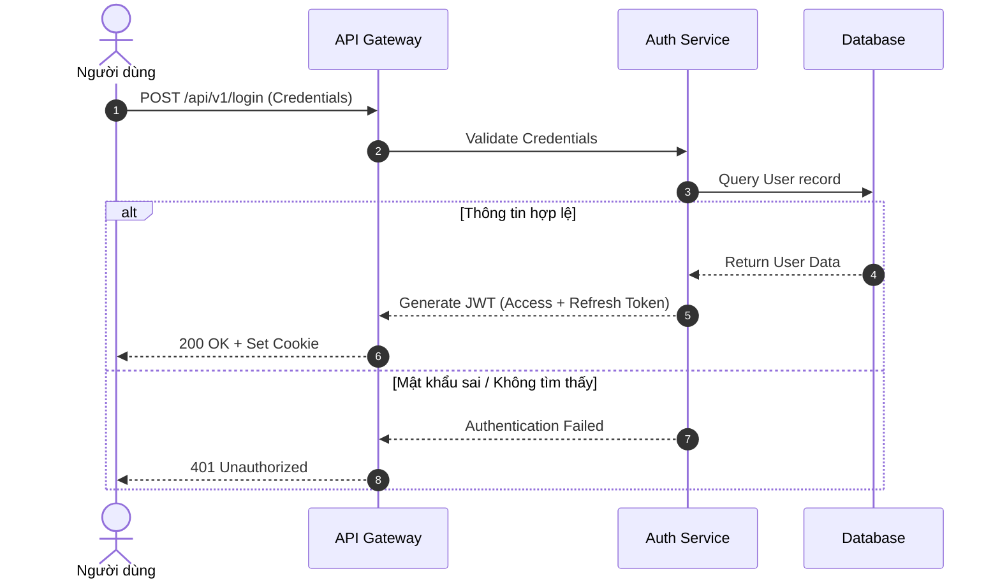

---
tags:
  [
    type/concept,
    topic/knowledge-management,
    topic/documentation,
    topic/workflow,
  ]
date: 2026-07-24
aliases:
  [
    Visual Workflow Documentation Policy,
    Chính sách Tài liệu hóa Quy trình Trực quan,
    Visual Workflow Policy,
  ]
description: "Visual Workflow Documentation Policy là bộ quy chuẩn quản trị tài liệu bắt buộc nhằm chuyển đổi luồng công việc (workflow), quy trình xử lý và kiến trúc hệ thống từ dạng văn bản thô sang mô hình tr..."
---

# Visual Workflow Documentation Policy

## TL;DR

**Visual Workflow Documentation Policy** là bộ quy chuẩn quản trị tài liệu bắt buộc nhằm chuyển đổi luồng công việc (workflow), quy trình xử lý và kiến trúc hệ thống từ dạng văn bản thô sang mô hình trực quan hóa (Diagrams/Flowcharts). Giúp loại bỏ sự mơ hình, tối ưu hóa tốc độ tiếp cận (onboarding) và phát hiện điểm nghẽn hệ thống.

## Core Concept

- **Visual-First Rule:** Mọi quy trình phần mềm (SDLC), luồng dữ liệu (Data flow) hoặc quy trình nghiệp vụ (Business logic) từ 3 bước trở lên bắt buộc phải đi kèm sơ đồ trực quan.
- **Docs-as-Code Integration:** Sơ đồ trực quan phải được viết bằng mã (như Mermaid.js, PlantUML) lưu trữ trực tiếp trong tài liệu Markdown của Git repository để dễ dàng quản lý phiên bản (Version Control) và diff khi review PR.
- **Single Source of Truth (SSOT):** Mỗi sơ đồ phải thuộc về một chủ sở hữu (Process Owner) duy nhất và gắn liền với phiên bản mã nguồn/quy trình thực tế hiện hành. Sơ đồ lỗi thời không được cập nhật phải bị gắn nhãn `Deprecated` hoặc lưu trữ.

## Practical Implementation

### 1. Quy Chuẩn Công Cụ & Ký Hiệu

- **Công cụ mặc định:** Sử dụng `Mermaid.js` nhúng trực tiếp trong file Markdown.
- **Quy chuẩn biểu đồ theo ngữ cảnh:**
  - **Sequence Diagram:** Dùng mô tả tương tác API giữa các dịch vụ, HTTP requests/responses, microservices.
  - **Flowchart / Swimlanes:** Dùng mô tả quy trình nghiệp vụ phân vai trò (User vs System vs Admin).
  - **Architecture Diagram:** Dùng mô tả quan hệ giữa các component, database, queue và third-party services.

### 2. Tiêu Chuẩn Cấu Trúc Mỗi Biểu Đồ

Mỗi sơ đồ trực quan khi đưa vào tài liệu bắt buộc thỏa mãn 4 yếu tố:

1. **Ranh giới (Boundaries):** Điểm kích hoạt đầu vào (Trigger/Input) và điểm kết thúc đạt tiêu chuẩn (Output/Outcome).
2. **Luồng xử lý lỗi (Exception Paths):** Thể hiện rõ nhánh thành công (Happy Path) và các nhánh rẽ khi gặp lỗi (Error Handlers).
3. **Ký hiệu chuẩn hóa:** Tên gọi tương ứng chính xác với tên hàm, tên API hoặc tên cột DB trong codebase.
4. **Chú thích ngắn gọn:** Kèm theo 2-3 câu giải thích bối cảnh bên dưới biểu đồ.

### 3. Ví Dụ Mẫu

### 4. Quy Trình Bảo Trì Tài Liệu

- **Review Gate:** Mọi Pull Request (PR) làm thay đổi luồng API hoặc quy trình hệ thống đều bắt buộc phải cập nhật sơ đồ Mermaid tương ứng.
- **Periodic Audit:** Đánh giá định kỳ theo quý (Quarterly Audit) để dọn dẹp hoặc cập nhật sơ đồ cũ.

---

## Related Notes

- Phương pháp quản lý dòng công việc: [[Kanban_Methodology]]
- Quản lý quy trình dự án chuẩn: [[Standard_Project_Timeline_SOP]]
- Quản lý dự án Agile trên GitHub: [[Agile_Management_via_GitHub]]
- Cấu trúc hệ thống Second Brain: [[000_System_Structure]]
