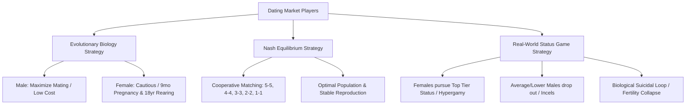

# Dating Game Theory

## TL;DR

Lý thuyết trò chơi trong Hẹn hò (Dating Game Theory) giải thích thị trường tìm kiếm bạn đời thông qua mô hình 3 yếu tố: **Người chơi (Players)**, **Ràng buộc (Rules/Constraints)** và **Động cơ (Incentives)**. Thay vì vận hành theo Cân bằng Nash lý tưởng hay thuần túy tâm lý học tiến hóa, thị trường hẹn hò hiện đại biến thành trò chơi **Địa vị (Status Game)** — một trò chơi Tổng bằng Không (Zero-sum Game). Khi Kiến trúc thượng tầng (Superstructure) của xã hội đạt đến giai đoạn quá tải dân số và dư thừa tài sản, trò chơi địa vị khiến tỷ lệ sinh sụt giảm nghiêm trọng, dẫn đến nguy cơ sụp đổ văn minh.

---

## Core Framework of Game Theory

Lý thuyết trò chơi (Game Theory) cung cấp khung tư duy để phân tích hành vi của con người, tổ chức và quốc gia thông qua 3 thành tố cốt lõi:

1. **Players (Người chơi):** Các cá nhân hoặc thực thể tham gia vào trò chơi (trong thị trường hẹn hò là nam giới và nữ giới).
2. **Rules / Constraints (Luật chơi & Ràng buộc):** Các giới hạn sinh học, chuẩn mực xã hội, pháp luật, thể chế và trình độ kinh tế - công nghệ.
3. **Incentives (Động cơ & Phần thưởng):** Mục tiêu mà người chơi hướng tới để tối đa hóa lợi ích cá nhân (địa vị, tài sản, gen, sự an toàn).

### 3 Lợi ích khi làm chủ Game Theory

- **Tư duy phản biện (Critical Thinking):** Hiểu rõ lý do đằng sau các quyết định và hành vi xã hội thay vì chỉ đánh giá bề nổi.
- **Giải mã thực tại (Understanding Current Events):** Phân tích nguyên nhân cốt lõi của các biến động chính trị, kinh tế, địa chính trị và xung đột xã hội.
- **Năng lực dự đoán (Predictive Power):** Nhìn thấy hướng phát triển của xã hội và cuộc sống cá nhân, từ đó làm chủ vận mệnh (Sovereignty).

---

## Dating Game Model & Nash Equilibrium

### 3 Tiêu chí đánh giá giá trị thu hút

Người chơi trong thị trường hẹn hò được xếp hạng dựa trên 3 tiêu chuẩn chính:

- **Gen (Genes):** Ngoại hình, chiều cao, sức khỏe, khả năng sống thọ và truyền lại bộ gen tốt.
- **Tài sản (Wealth):** Khả năng tài chính cá nhân và tiềm lực gia đình.
- **Địa vị xã hội (Status):** Quyền lực, công việc có vị thế cao, mạng lưới quan hệ xã hội.

### Xung đột Động lực Tiến hóa & Cân bằng Nash

1. **Động lực Sinh học Tiến hóa (Evolutionary Psychology):**
   - **Nam giới:** Chi phí sinh học thấp $\rightarrow$ Động cơ tối đa hóa số lượng bạn đời để truyền gen.
   - **Nữ giới:** Chi phí sinh học cực cao (mang thai 9 tháng đau đớn, nuôi dạy 16-18 năm) $\rightarrow$ Động cơ cực kỳ thận trọng trong lựa chọn bạn đời.
2. **Cân bằng Nash Lý tưởng (Nash Equilibrium):**
   - Để tối ưu hóa xã hội và tránh sụp đổ chủng tộc, chiến lược hợp tác tốt nhất là ghép đôi tương đồng theo thứ hạng: Người thứ hạng 5 kết hôn với người thứ hạng 5, 4 ghép với 4, 3 ghép với 3, 2 ghép với 2, 1 ghép với 1.
   - Trạng thái này giúp mọi người chơi đều đạt kết quả tốt nhất có thể, duy trì tỷ lệ sinh thay thế (Replacement Rate $\ge 2.1$).

### Thực tế lệch khỏi Nash: Trò chơi Địa vị

Trong thực tế, xã hội không vận hành theo Cân bằng Nash lý tưởng vì:

- **Động cơ thực sự không phải là tình dục hay sinh sản, mà là ĐỊA VỊ (Status):** Người ta chọn bạn đời để phô trương xã hội (Instagram, khoe khoang, làm người khác ghen tị) hơn là duy trì nòi giống.
- **Sự trỗi dậy của Hypergamy:** Phụ nữ tập trung cạnh tranh vào nhóm nhỏ nam giới ở đỉnh cao địa vị/tài sản (tỷ phú, ngôi sao).
- **Hiện tượng Rút lui (Incels):** Nhóm nam giới trung bình và thấp (thứ hạng 1, 2, 3) từ bỏ cuộc chơi hẹn hò, rút lui vào trò chơi điện tử, phim ảnh và nội dung khiêu dâm.
- **Chiến lược "Tự sát Sinh học" (Suicidal Strategy):** Sự tập trung vào địa vị khiến đại đa số người chơi không sinh con, dẫn đến sụt giảm dân số tự nhiên.

---

## 3 Historical Superstructures

Bản chất của trò chơi hẹn hò thay đổi tùy thuộc vào **Kiến trúc thượng tầng (Superstructure)** — bao gồm dân số, kinh tế, công nghệ, chính trị và tôn giáo.

| Giai đoạn            | Đặc điểm Kiến trúc Thượng tầng                                                                      | Cơ chế Hẹn hò / Kết hôn                                                                                                                                      | Tác động Sinh sản                                             |
| :------------------- | :-------------------------------------------------------------------------------------------------- | :----------------------------------------------------------------------------------------------------------------------------------------------------------- | :------------------------------------------------------------ |
| **Superstructure 1** | Dân số thấp, nghèo, công nghệ thấp, cạnh tranh thấp (Thời kỳ bộ lạc sơ khai).                       | **Che giấu quan hệ cha con (Disguise Paternity):** Không có hẹn hò cá nhân; giao phối rộng rãi để mọi nam giới trong làng đều có trách nhiệm bảo vệ đứa trẻ. | Tỷ lệ sinh cao, tỷ lệ tử vong cao, duy trì cân bằng sinh học. |
| **Superstructure 2** | Dân số phát triển, tài sản tăng, cạnh tranh gay gắt giữa các nhóm (Thời kỳ Nông nghiệp / Đế chế).   | **Hôn nhân sắp đặt (Arranged Marriage):** Bỏ qua cảm xúc cá nhân, cha mẹ quyết định nhằm tối đa hóa số con để phục vụ chiến tranh và lao động.               | Tỷ lệ sinh bùng nổ, đảm bảo sức mạnh quốc gia.                |
| **Superstructure 3** | Quá tải dân số, dư thừa tài sản, bất bình đẳng cao, công nghệ y tế cao, hòa bình (Xã hội Hiện đại). | **Dating Game Cá nhân:** Quyền tự do lựa chọn gắn liền với cuộc đua Địa vị cá nhân.                                                                          | Tỷ lệ sinh sụp đổ dưới mức thay thế ($< 2.1$).                |

---

## Societal Implications & Civilization Life Cycle

### Chu kỳ sống của Văn minh

Lý thuyết trò chơi chỉ ra các văn minh đều trải qua 3 giai đoạn: **Sinh ra (Superstructure 1) $\rightarrow$ Trưởng thành (Superstructure 2) $\rightarrow$ Sụp đổ (Superstructure 3)**.

- **Chỉ dấu sụp đổ Lịch sử:** Khi nữ giới có học thức cao và giàu có từ chối sinh con, văn minh đó bước vào giai đoạn suy vong (tương tự Đế chế La Mã cổ đại, Châu Âu, Đông Á hiện đại).
- **Hạn chế của Tiền bạc:** Tiền là vô hạn nhưng Địa vị là **Tổng bằng Không (Zero-sum Game)**. Các chính sách trợ cấp tiền bạc của chính phủ (như Hàn Quốc) hoàn toàn thất bại vì không thể tăng địa vị tương đối cho người dân.
- **Ngoại lệ Israel:** Israel là quốc gia giàu có, công nghệ cao duy nhất có tỷ lệ sinh $> 3.0$ vì **Địa vị xã hội gắn liền với nghĩa vụ tôn giáo và sự sinh tồn dân tộc** (Fertility = Patriotism/Status).

---

## Related Notes

- Tổng quan MOC khái niệm: [[000_Concepts_MOC]]
- Tư duy Hệ thống: [[Systems_Thinking]]
- Các mô hình tư duy phản biện: [[Critical_Thinking_Models]]
- Chi phí cơ hội: [[Opportunity_Cost_Hold]]
