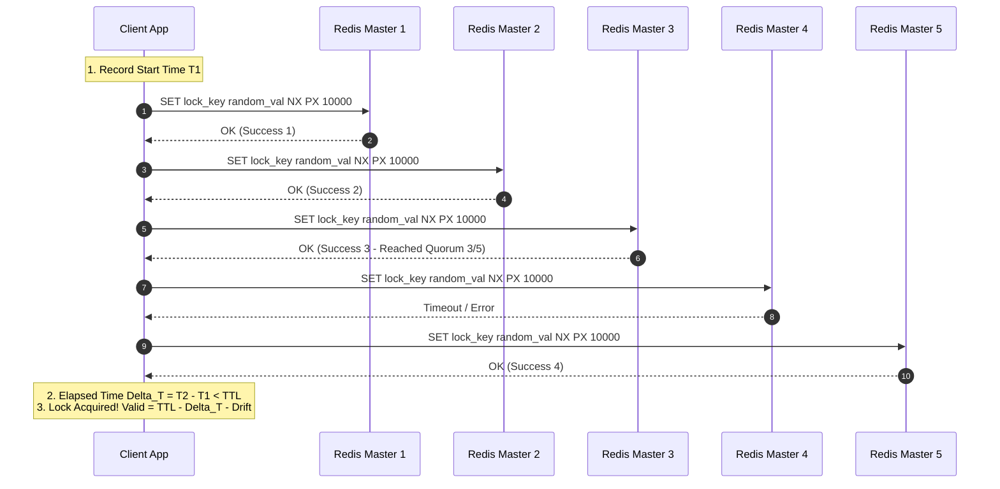

# Redis Redlock

## TL;DR

Redis Redlock là thuật toán khóa phân tán (Distributed Lock) do Salvatore Sanfilippo (antirez) thiết kế, sử dụng $N$ nút Redis Master hoàn toàn độc lập (thường chọn $N=5$) để đạt cơ chế đồng thuận số đông (Quorum). Thuật toán giải quyết triệt để điểm lỗi đơn lẻ (SPOF) và hiện tượng tranh chấp dữ liệu (Race Condition) xuất hiện do cơ chế nhân bản bất đồng bộ (Async Replication) khi dùng Redis Primary-Replica thông thường.

## Core Concept

- **Tại sao nó tồn tại & Giải quyết bài toán gì?**
  - **Khóa đơn nút (Single Instance):** Sử dụng lệnh `SET key value NX PX ttl` hoạt động rất nhanh nhưng gặp rủi ro điểm lỗi đơn lẻ (Single Point of Failure - SPOF). Nếu Redis node ngưng hoạt động, toàn bộ cơ chế lock sập.
  - **Cụm Master-Replica truyền thống:** Redis áp dụng cơ chế Async Replication để tối ưu hiệu năng. Khi Client A lấy thành công lock trên Master, nếu Master gặp sự cố trước khi kịp đồng bộ key lock sang Replica, Sentinel/Cluster sẽ quảng bá Replica lên làm Master mới. Lúc này key lock bị mất, cho phép Client B lấy lại đúng lock đó -> Gây ra **Race Condition** và hỏng tính nhất quán dữ liệu (Split-Brain).
  - **Redlock solution:** Không dựa vào cơ chế replication giữa Master và Replica. Thay vào đó, Redlock triển khai trên $N$ node Redis Master hoàn toàn độc lập (không kết nối master-slave với nhau) và chỉ cấp lock khi đạt được sự đồng thuận số đông (Quorum).

- **Nó có thay thế cái gì hay không?**
  - Thay thế cơ chế khóa đơn nút hoặc khóa Master-Replica ngây thơ trên Redis khi ứng dụng yêu cầu tính sẵn sàng cao (High Availability).
  - So sánh với các hệ thống khóa đồng thuận mạnh (Strong Consensus): Các giải pháp dựa trên Paxos/Raft như ZooKeeper, etcd cung cấp tính nhất quán tuyệt đối (Strict Consistency) nhưng chi phí latency và overhead cao hơn. Redlock cung cấp sự cân bằng giữa hiệu năng cao của Redis và độ tin cậy phân tán.

- **Áp dụng vào những dự án nào?**
  - Các hệ thống Microservices / Phân tán cần đảm bảo một công việc (Background Job, Cron Task, Report Generation) chỉ được thực thi bởi duy nhất một instance tại một thời điểm.
  - Xử lý đơn hàng, ngăn chặn trùng lặp giao dịch (Duplicate Event Processing) hoặc Rate Limiting phân tán ở quy mô lớn.

- **Cơ chế hoạt động (How it works under the hood)**
  1. **Bắt đầu:** Lấy mốc thời gian hiện tại $T_1$ theo miligiây.
  2. **Thực thi song song/nối tiếp:** Lần lượt gửi yêu cầu lấy lock trên tất cả $N$ node Redis độc lập bằng cùng một `key` và một giá trị ngẫu nhiên duy nhất `random_value` (dùng GUID/Token ngẫu nhiên để an toàn khi release). Đặt timeout cho mỗi thao tác lấy lock nhỏ hơn nhiều so với TTL (ví dụ TTL = 10s, timeout node = 5-50ms) để tránh bị đơ khi có node chết hoặc chậm trễ mạng.
  3. **Tính toán đồng thuận:** Đếm số node cấp lock thành công và tính thời gian đã trôi qua $\Delta T = T_2 - T_1$.
  4. **Điều kiện công nhận Lock thành công:**
     - Lấy thành công khóa trên **đa số nút** (Quorum: $\ge \lfloor N/2 \rfloor + 1$, tức $\ge 3$ trên 5 nodes).
     - Tổng thời gian lấy lock $\Delta T < TTL$.
  5. **Thời gian hiệu lực (Validity Time):** Thời gian giữ lock thực tế còn lại cho ứng dụng được tính bằng:
     $$\text{Validity Time} = TTL - \Delta T - \text{Clock Drift}$$
  6. **Giải phóng khi thất bại:** Nếu không lấy được lock (không đủ Quorum hoặc hết TTL), client bắt buộc phải gửi lệnh giải phóng lock trên **tất cả** $N$ node Redis (kể cả các node chưa thiết lập lock thành công) để đảm bảo dọn dẹp các key rác do timeout gây ra.

## Practical Implementation

- **Trade-offs & Tranh luận kinh điển (Martin Kleppmann vs Salvatore Sanfilippo)**
  - **Góc nhìn phản biện của Martin Kleppmann:**
    - _NTP Clock Drift (Lệch đồng hồ hệ thống):_ Nếu đồng hồ của một node Redis nhảy tiến (do NTP điều chỉnh), TTL của lock trên node đó sẽ bị hết hạn sớm hơn các node khác, làm vỡ tính Quorum.
    - _Process Pauses (Tạm dừng tiến trình - STW GC):_ Client A lấy thành công lock trên 3/5 nodes, nhưng ngay sau đó rơi vào trạng thái Stop-The-World Garbage Collection (STW GC) hoặc nghẽn I/O trong 15 giây. Trong thời gian Client A tạm dừng, TTL hết hạn. Client B nhảy vào lấy thành công lock trên 3/5 nodes. Khi Client A tỉnh dậy, nó vẫn tin rằng mình đang giữ lock và thực thi ghi dữ liệu -> Tranh chấp dữ liệu nghiêm trọng.
    - _Kết luận của Kleppmann:_ Để đảm bảo tính chính xác tuyệt đối (Safety/Correctness), hệ thống bắt buộc phải có **Fencing Token** (một số đếm tăng dần được kiểm tra tại tầng lưu trữ như Database). Nếu tầng lưu trữ đã có Fencing Token thì không cần Redlock; nếu không có Fencing Token thì Redlock không đủ an toàn.
  - **Góc nhìn bảo vệ của Antirez (Tác giả Redis):**
    - Antirez lập luận rằng Redlock giả định hệ thống có giới hạn lệch đồng hồ (Bounded Clock Drift) hợp lý.
    - Bài toán STW GC áp dụng cho mọi hệ thống phân tán nếu không sử dụng Fencing Token tại tầng lưu trữ. Redlock phù hợp cho mục đích tối ưu hiệu năng (Efficiency) với độ tin cậy tiệm cận tuyệt đối.
  - **Khuyến nghị áp dụng thực tế:**
    - **Dùng Redlock khi:** Ưu tiên hiệu năng cao, ngăn chặn việc thực thi lặp lại không mong muốn (Efficiency), ví dụ: gửi email thông báo trùng, chạy cronjob tính toán thống kê.
    - **KHÔNG dùng Redlock khi:** Xử lý giao dịch tài chính hoặc chuyển tiền yêu cầu tính đúng đắn tuyệt đối (Correctness) nếu không kết hợp cơ chế Fencing Token ở tầng Database.

- **Architecture Diagram & Code Example**



- **Atomic Lock Release Lua Script:**

```lua
-- Lua script giải phóng lock an toàn (tránh xóa lock của client khác)
-- KEYS[1]: tên lock key
-- ARGV[1]: random_value duy nhất do client sinh ra khi aquire lock
if redis.call("get", KEYS[1]) == ARGV[1] then
    return redis.call("del", KEYS[1])
else
    return 0
end
```

- **TypeScript Example với `redlock` library:**

```typescript
import Redis from "ioredis";
import Redlock from "redlock";

// Khởi tạo 3 hoặc 5 instance Redis Master độc lập
const client1 = new Redis({ host: "redis-node-1.internal", port: 6379 });
const client2 = new Redis({ host: "redis-node-2.internal", port: 6379 });
const client3 = new Redis({ host: "redis-node-3.internal", port: 6379 });

const redlock = new Redlock([client1, client2, client3], {
  driftFactor: 0.01, // Hệ số bù lệch đồng hồ
  retryCount: 3,
  retryDelay: 200, // Thời gian chờ giữa các lần thử (ms)
  retryJitter: 50,
});

async function processExclusiveTask(resourceId: string): Promise<void> {
  const resourceKey = `locks:order:${resourceId}`;
  const ttlMs = 10000; // 10 giây TTL

  let lock;
  try {
    // Acquire lock trên Quorum Redis instances
    lock = await redlock.acquire([resourceKey], ttlMs);
    console.log(`Lock acquired successfully. Value: ${lock.value}`);

    // Thực thi business logic bị giới hạn độc quyền
    await doCriticalWork(resourceId);
  } catch (err) {
    console.error("Failed to acquire Redlock quorum:", err);
    throw err;
  } finally {
    // Giải phóng lock an toàn bằng Lua Script (chỉ giải phóng nếu sở hữu lock)
    if (lock) {
      await lock.release().catch((err) => {
        console.error("Failed to release lock cleanly:", err);
      });
    }
  }
}
```

---

**Related Notes:**

- [[Postgres_Select_For_Update_Pessimistic_Locking]]
- [[Outbox_Pattern]]
- [[Multi_Layer_Rate_Limiting_DDoS_Prevention]]
- [[RFC_Trending_Cache]]
