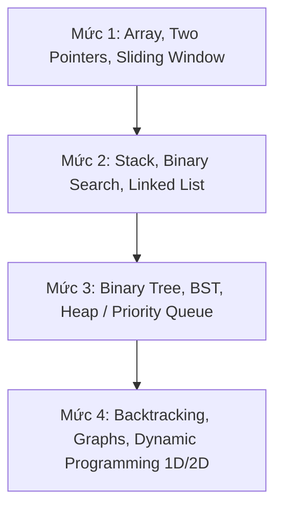

# LeetCode Pattern Mastery Roadmap

## TL;DR

Lộ trình cày LeetCode thông minh dựa trên tư duy nhận dạng Pattern (Pattern Recognition) từ các bộ đề nổi tiếng thế giới (**NeetCode 150**, **Blind 75**, **Striver SDE Sheet**). Thay vì giải $500+$ bài vô định, lộ trình này giúp lập trình viên Backend làm chủ 15 dạng bài cốt lõi với mục tiêu giải 1 bài/ngày ($40$ phút) trong khung giờ Deep Work 2 tối.

---

## Core Concept & Rationales

### 1. Học Theo Pattern > Giải Bài Vô Định

Phần lớn các câu hỏi phỏng vấn thuật toán tại các công ty Tech đều là biến thể của **15 Dạng Mẫu (Patterns)**. Khi nắm vững tư duy cốt lõi của một Pattern, bạn có thể tự mình giải hàng chục bài tương tự mà không cần học thuộc lòng code.

### 2. Bộ 3 Lựa Chọn Đề Chuẩn Quốc Tế

- **Blind 75**: Bộ 75 bài rút gọn kinh điển nhất cho người bận rộn.
- **NeetCode 150 (Khuyên dùng)**: Mở rộng từ Blind 75 lên 150 bài, phân loại thành 15 nhóm Pattern siêu sạch kèm video giải thích trực quan trên `NeetCode.io`.
- **Striver SDE Sheet**: Bộ đề chuyên sâu của Ấn Độ cho người muốn cày sâu mảng Linked List, Recursion & Dynamic Programming.

---

## Practical Implementation

### ️ Lộ Trình 15 Patterns Theo Chuỗi Tiến Trình

#### Nhóm 1: Cơ Bản & Mảng

1. **Arrays & Hashing**: `Two Sum`, `Contains Duplicate`, `Valid Anagram`, `Group Anagrams`, `Top K Frequent Elements`.
2. **Two Pointers**: `Valid Palindrome`, `Two Sum II (Sorted)`, `3Sum`, `Container With Most Water`.
3. **Sliding Window**: `Best Time to Buy and Sell Stock`, `Longest Substring Without Repeating Characters`, `Longest Repeating Character Replacement`.

#### Nhóm 2: Cấu Trúc Tuyến Tính & Tìm Kiếm

4. **Stack & Monotonic Stack**: `Valid Parentheses`, `Min Stack`, `Daily Temperatures`.
5. **Binary Search**: `Binary Search`, `Search a 2D Matrix`, `Koko Eating Bananas`, `Find Minimum in Rotated Sorted Array`.
6. **Linked List**: `Reverse Linked List`, `Merge Two Sorted Lists`, `Reorder List`, `Remove Nth Node From End`, `Linked List Cycle`.

#### Nhóm 3: Cấu Trúc Cây & Ưu Tiên

7. **Trees (Binary Tree & BST)**: `Invert Binary Tree`, `Maximum Depth of Binary Tree`, `Diameter of Binary Tree`, `Balanced Binary Tree`, `Lowest Common Ancestor`, `Binary Tree Level Order Traversal`.
8. **Heap / Priority Queue**: `Kth Largest Element in a Stream`, `Last Stone Weight`, `Kth Largest Element in an Array`.
9. **Trie (Prefix Tree)**: `Implement Trie (Prefix Tree)`, `Design Add and Search Words Data Structure`.

#### Nhóm 4: Đồ Thị & Quy Hoạch Động

10. **Backtracking**: `Subsets`, `Combination Sum`, `Permutations`.
11. **Graphs (BFS / DFS)**: `Number of Islands`, `Clone Graph`, `Max Area of Island`, `Pacific Atlantic Water Flow`.
12. **1D Dynamic Programming**: `Climbing Stairs`, `Min Cost Climbing Stairs`, `House Robber`, `Coin Change`, `Longest Increasing Subsequence`.
13. **2D Dynamic Programming**: `Unique Paths`, `Longest Common Subsequence`.
14. **Greedy**: `Maximum Subarray`, `Jump Game`.
15. **Bit Manipulation**: `Single Number`, `Number of 1 Bits`, `Counting Bits`.

---

### ⏱️ Quy Trình 40 Phút Giải 1 Bài LeetCode Mỗi Tối

1. **5 Phút Đầu (Đọc Đề & Bóc Tách Pattern)**:
   - Đọc kỹ Input/Output constraints ($N \le 10^5 \rightarrow O(N \log N)$ hoặc $O(N)$, không dùng $O(N^2)$ được).
   - Xác định Pattern: _"Bài này dùng Two Pointers hay Sliding Window?"_.
2. **15 Phút Tiếp Theo (Tự Giải & Viết Code)**:
   - Tự nháp thuật toán bằng tiếng Anh ra giấy hoặc comment trong IDE.
   - Code bằng ngôn ngữ chính (TypeScript/NodeJS/Go/C#).
3. **10 Phút Cuối (Nếu Kẹt $\rightarrow$ Đọc NeetCode Solution)**:
   - Nếu qua 20 phút không nghĩ ra $\rightarrow$ Mở thẳng giải thích trên `NeetCode.io`. Học cách tư duy của họ thay vì ngồi tự dằn dặn.
4. **5 Phút Tổng Kết (Lưu Anki & Tech Vocab)**:
   - Note từ mới và tư duy cốt lõi vào Anki (`50_Flashcards/Vocabulary/Software_Engineering/`).

---

## Related Notes

- Lộ trình tổng thể Backend: [[Backend_Engineering_Mastery_Pipeline]]
- Hướng dẫn System Design: [[System_Design_Architecture_Roadmap]]
- Hướng dẫn SQL Benchmark: [[Postgres_SQL_Performance_Benchmarking_Guide]]
- Danh mục Data Structures: [[Data_Structures_and_Algorithms_Roadmap]]
