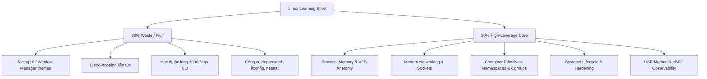
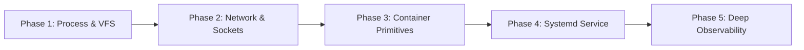

---
tags:
  [
    type/method,
    topic/devops,
    topic/infrastructure,
    topic/backend,
    layer/core-mechanics,
    layer/infrastructure,
  ]
date: 2026-08-22
aliases:
  [
    Linux Mastery Core Roadmap,
    Lộ trình học Linux 80 20 Thực chiến,
    Linux 80 20 Roadmap,
    Arch Linux Mastery Guide,
  ]
description: "Lộ trình vọc vạch và làm chủ Linux thực chiến theo nguyên tắc 80/20 trên nền tảng Arch Linux, tập trung 20% kiến thức cốt lõi (Process, Memory, VFS, Sockets, Namespaces, Cgroups, Systemd, eBPF) tạo ra 80% năng lực giải quyết sự cố trong môi trường Enterprise và Production."
---

# Linux Mastery Core Roadmap

## TL;DR

- **Bản chất**: Lộ trình chắt lọc 20% kiến thức Linux nền tảng (Kernel Primitives, Process Memory, Sockets, Namespaces, Cgroups, Systemd, eBPF Tracing) trên Arch Linux thay vì học lan man 80% phần thừa (ricing, distro-hopping, flags vụn vặt).
- **Mục đích**: Xây dựng năng lực chẩn đoán sự cố hệ thống (Troubleshooting) và hiểu sâu bản chất container/hạ tầng production (Kubernetes, SRE, DevOps, Backend).
- **Điểm mấu chốt**: Áp dụng phương pháp Evidence-Based (USE Method) kết hợp thực hành trực tiếp trên terminal bằng các công cụ hiện đại (`ss`, `ip`, `unshare`, `journalctl`, `strace`, `bpftrace`).

---

## Core Concept & Rationales

### 1. Bộ Lọc 80/20 (Brutal Filter)

Doanh nghiệp và môi trường Production quan tâm tới khả năng duy trì Uptime, khắc phục sự cố dưới áp lực (Incident Management) và hiểu bản chất phân bổ tài nguyên.



### 2. Tại Sao Chọn Arch Linux Làm Môi Trường Lab

- **Vanilla Upstream Components**: Arch Linux không đóng gói tùy biến sâu như Ubuntu/RHEL mà giữ nguyên thiết kế gốc từ Linux kernel và systemd.
- **Modern Defaults**: Mặc định sử dụng Cgroups v2, systemd thuần túy, và bộ công cụ mạng `iproute2`/`nftables`.
- **Cơ chế minh bạch**: Toàn bộ cấu hình hệ thống nằm tường minh trong `/etc/`, `/proc/`, `/sys/`, không bị che giấu bởi các trình wizard đồ họa.

---

## Practical Implementation: 5 Giai Đoạn Thực Chiến



---

### Phase 1: Process, Memory & Virtual File System (VFS)

Hiểu rõ cách Linux Kernel cấp phát bộ nhớ ảo, quản lý vòng đời tiến trình và trừu tượng hóa mọi tài nguyên thành File Descriptor.

#### 1. Mental Model Cốt Lõi

- **Process Lifecycle**: `fork()` $\rightarrow$ `execve()` $\rightarrow$ `wait()` / `exit()`. Phân biệt Zombie Process (chờ parent gặt exit code) vs Orphan Process (parent chết trước, được `PID 1` nhận nuôi).
- **Memory Anatomy**: VIRT (Virtual Memory) vs RES (Resident Memory thực tế) vs SHR (Shared Memory). Vai trò của Page Cache, Dirty Pages, và cơ chế Swap.
- **OOM Killer (Out Of Memory)**: Cách kernel tính toán `oom_score` (`/proc/[pid]/oom_score`) để gửi tín hiệu `SIGKILL` khi cạn kiệt RAM vật lý.
- **VFS & File Descriptors**: Mỗi socket, file, anonymous pipe đều được cấp phát 1 File Descriptor (FD) trong bảng FD của tiến trình.

#### 2. Arch Linux Terminal Drills

```bash
# 1. Khảo sát cấu trúc tiến trình qua /proc
cat /proc/$$/status
cat /proc/$$/limits
ls -la /proc/$$/fd/
cat /proc/$$/smaps_rollup

# 2. Kiểm tra bộ nhớ thực tế (Page Cache vs Available)
free -h
vmstat 1 5

# 3. Liệt kê file descriptors đang mở của tiến trình
lsof -p $$
```

---

### Phase 2: Modern Linux Networking & Socket Anatomy

Nắm vững đường đi của packet trong Linux Network Stack và kỹ năng định tuyến, phân tích kết nối socket.

#### 1. Mental Model Cốt Lõi

- **Socket Lifecycle & States**: `LISTEN` $\rightarrow$ `SYN_SENT` $\rightarrow$ `ESTABLISHED` $\rightarrow$ `TIME_WAIT` (client chủ động đóng) $\rightarrow$ `CLOSE_WAIT` (server chưa gọi `close()`).
- **Networking Abstractions**: Loopback (`lo`), Physical Interface (`eth0`/`enp*`), Virtual Ethernet (`veth`), Linux Bridge (`br0`), Routing Table.
- **DNS Resolution Pipeline**: `/etc/nsswitch.conf` $\rightarrow$ `/etc/hosts` $\rightarrow$ `/etc/resolv.conf` (hoặc `systemd-resolved`).
- **Packet Filtering**: Netfilter hooks, `nftables` (kiến trúc bytecode thay thế cho `iptables`).

#### 2. Arch Linux Terminal Drills

```bash
# 1. Giám sát socket listening và connections bằng ss (thay thế netstat)
ss -tulpn
ss -tan | awk '{print $1}' | sort | uniq -c

# 2. Thao tác Network Interface và Routing bằng iproute2
ip -br addr
ip -br link
ip route show

# 3. Bắt gói tin phân tích 3-way handshake với tcpdump
sudo tcpdump -nn -i any port 443 -c 10

# 4. Kiểm tra phân giải tên miền
resolvectl status
getent hosts google.com
```

---

### Phase 3: Container Primitives from Scratch

Bản chất của Docker và Kubernetes Pods: Không có "Container" như một thực thể phần cứng ảo, chỉ có tiến trình Linux thông thường bị cô lập bởi **Namespaces** và giới hạn bởi **Cgroups**.

#### 1. Mental Model Cốt Lõi

- **Linux Namespaces (Cô lập không gian tên)**:
  - `PID`: Cây tiến trình riêng biệt (tiến trình nhìn thấy mình là `PID 1`).
  - `NET`: Card mạng, loopback, routing table, firewall rules riêng.
  - `MNT`: Hệ thống mount point độc lập.
  - `UTS`: Hostname riêng.
  - `IPC` & `USER`: Cô lập hàng đợi thông điệp và user ID mappings.
- **Control Groups v2 (Giới hạn tài nguyên)**:
  - CPU Quota & Throttling: `cpu.max`.
  - Memory Limits: `memory.max`, `memory.high`.
- **Filesystem Isolation**: Chuyển gốc thư mục qua `chroot` / `pivot_root` và cơ chế xếp tầng `OverlayFS`.

#### 2. Arch Linux Terminal Drills

```bash
# 1. Tự tạo isolated environment không cần Docker bằng unshare
sudo unshare --fork --pid --mount --uts /bin/bash

# Bên trong isolated shell: đổi hostname độc lập
hostname sandbox-box
hostname

# 2. Tạo Cgroup v2 giới hạn RAM 50MB thủ công
sudo mkdir -p /sys/fs/cgroup/test_limit
echo "50M" | sudo tee /sys/fs/cgroup/test_limit/memory.max
echo $$ | sudo tee /sys/fs/cgroup/test_limit/cgroup.procs
```

---

### Phase 4: Systemd Service Lifecycle & Security Hardening

Quản lý tiến trình chạy nền theo chuẩn Production, đảm bảo tự phục hồi sau lỗi và giới hạn đặc quyền bảo mật.

#### 1. Mental Model Cốt Lõi

- **Systemd Unit Types**: `.service` (quản lý daemon), `.timer` (lập lịch thay thế `cron`), `.socket` (kích hoạt theo socket).
- **Dependency Graph**: Quan hệ thứ tự và điều kiện `After=`, `Requires=`, `Wants=`, `Before=`.
- **Restart Strategies**: `Restart=on-failure`, `RestartSec=5s` để chống Crash Loop làm nghẽn CPU.
- **Security Sandboxing**: `ProtectSystem=strict`, `NoNewPrivileges=true`, `PrivateTmp=true`, `ProtectHome=true`.

#### 2. Arch Linux Terminal Drills

Tạo file service chuẩn hóa tại `/etc/systemd/system/app-production.service`:

```ini
[Unit]
Description=Production Node Application
After=network.target

[Service]
Type=simple
User=nobody
ExecStart=/usr/bin/python -m http.server 8080
Restart=on-failure
RestartSec=3s

# Sandbox Security Directives
ProtectSystem=strict
NoNewPrivileges=true
PrivateTmp=true
MemoryMax=250M

[Install]
WantedBy=multi-user.target
```

Thao tác quản lý và xem log:

```bash
sudo systemctl daemon-reload
sudo systemctl start app-production
sudo systemctl status app-production

# Truy vấn log theo service và lọc mức độ lỗi
journalctl -u app-production.service -p err -f
```

---

### Phase 5: Deep Observability & Troubleshooting (The USE Method)

Phương pháp tiếp cận có hệ thống của Brendan Gregg giúp xác định nguyên nhân nghẽn hệ thống trong vòng 60 giây.

#### 1. Mental Model: The USE Method

Mỗi tài nguyên phần cứng (CPU, Memory, Storage I/O, Network) cần được kiểm tra qua 3 chỉ số:

1. **Utilization**: Tỷ lệ phần trăm thời gian tài nguyên đang bận xử lý.
2. **Saturation**: Mức độ xếp hàng chờ của tác vụ (Queue Length, Task Load).
3. **Errors**: Bộ đếm lỗi phát sinh trên thiết bị hoặc driver.

#### 2. Toolchain Phân Tầng

- **Tầng 1 (Toàn cảnh - 60 giây đầu)**: `uptime` (Load Average), `dmesg -T | tail`, `vmstat 1`, `iostat -xz 1`, `free -m`.
- **Tầng 2 (Bắt System Calls)**: `strace` (chặn và đo lường thời gian thực thi các system call của tiến trình).
- **Tầng 3 (Kernel Dynamic Tracing)**: `perf`, `bpftrace` / `eBPF` (quan sát luồng dữ liệu trong kernel space với overhead cực thấp).

#### 3. Arch Linux Terminal Drills

```bash
# 1. Attach strace vào PID đang chạy để tìm syscall bị nghẽn
sudo strace -p <PID> -T -e trace=network,file,poll,epoll_wait

# 2. Thống kê tổng quan thời gian tiêu tốn cho từng syscall
sudo strace -c -p <PID>

# 3. Sử dụng bpftrace và BCC tools trên Arch Linux
sudo pacman -S bcc-tools bpftrace
# Quan sát toàn bộ file đang được mở realtime trên hệ thống
sudo opensnoop
# Đo latency của block I/O theo từng tiến trình
sudo biosnoop
```

---

## Self-Assessment Matrix (5 Câu Hỏi Xác Thực Năng Lực)

| Tình huống sự cố               | Triệu chứng quan sát                                                   | Nguyên nhân gốc rễ (Root Cause)                                                                        | Công cụ xác thực                                   |
| :----------------------------- | :--------------------------------------------------------------------- | :----------------------------------------------------------------------------------------------------- | :------------------------------------------------- |
| **High Load Average, Low CPU** | Load average vọt cao ($>10$), nhưng `%CPU` sử dụng $<15\%$.            | Tiến trình rơi vào trạng thái Uninterruptible Sleep (`D` state) do nghẽn Storage I/O hoặc NFS.         | `vmstat 1`, `iostat -xz 1`, `ps aux \| grep ' D '` |
| **Disk Space Not Reclaimed**   | Đã chạy `rm large_file.log` nhưng `df -h` vẫn báo $100\%$ dung lượng.  | File đã bị unlink khỏi directory tree nhưng tiến trình đang chạy vẫn giữ Open File Descriptor.         | `lsof +L1`, `ls -la /proc/*/fd`                    |
| **Socket Accumulation**        | Số lượng socket trạng thái `CLOSE_WAIT` tăng liên tục làm sập service. | Lỗi phía ứng dụng local: nhận được EOF/FIN từ remote host nhưng không gọi `close()` socket.            | `ss -tan \| grep CLOSE_WAIT`, `lsof -i`            |
| **Container OOM (Exit 137)**   | Container bị dừng đột ngột với exit code $137$.                        | $128 + 9 = \text{SIGKILL}$, kernel Cgroup memory limit bị vi phạm và trigger Cgroup OOM Killer.        | `dmesg -T \| grep -i oom`, `journalctl -k`         |
| **Silent Process Hang**        | Web API không trả kết quả, không sinh log lỗi mới.                     | Tiến trình đang bị block vô hạn tại một system call (ví dụ `epoll_wait`, `futex`, `read` trên socket). | `strace -p <PID> -T`                               |

---

## Related Notes

- Lộ trình tổng thể kỹ thuật Backend: [[Master_Backend_Engineering_SSOT]]
- Lộ trình thiết kế hệ thống: [[System_Design_Architecture_Roadmap]]
- Cơ chế quản lý bộ nhớ: [[Stack_vs_Heap_Memory_Fundamentals]]
- Khung tư duy giải quyết vấn đề: [[First_Principles_Thinking]]
- Khung tinh gọn học tập Just-In-Time: [[Metalearning_Just_In_Time_Framework]]
- Bản đồ danh mục Methods: [[000_Methods_MOC]]
