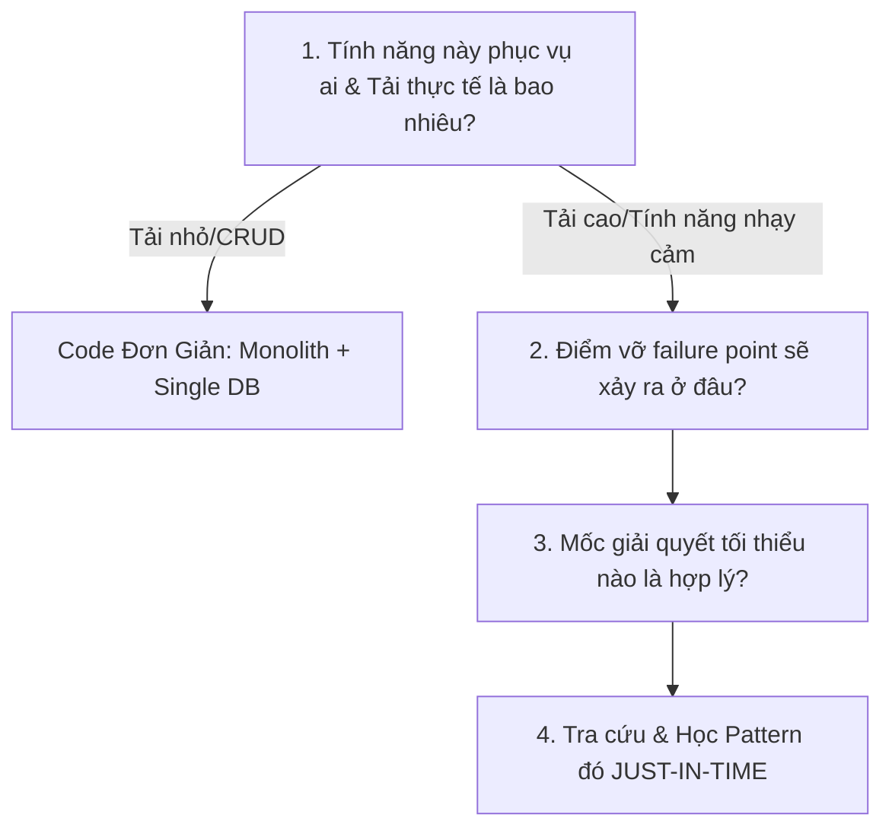

---
tags:
  [
    type/method,
    topic/backend,
    topic/system-design,
    topic/career,
    layer/architecture,
  ]
date: 2026-08-07
aliases:
  [
    Problem-Driven System Design,
    Incremental System Design Framework,
    Architectural Evolution Model,
    Tư duy thiết kế kiến trúc theo nhu cầu thực tế,
  ]
description: "Problem-Driven System Design Framework là phương pháp thiết kế kiến trúc hệ thống dựa trên nhu cầu kinh doanh thực tế và tải hệ thống thực tế (Tư duy Tiến hóa Kiến trúc - Incremental / Evolutionary..."
---

# Problem-Driven System Design Framework

## TL;DR

**Problem-Driven System Design Framework** là phương pháp thiết kế kiến trúc hệ thống dựa trên nhu cầu kinh doanh thực tế và tải hệ thống thực tế (Tư duy Tiến hóa Kiến trúc - _Incremental / Evolutionary Architecture_). Phương pháp này giúp triệt tiêu hoàn toàn sự quá tải nhận thức (_Cognitive Overload_) và cạm bẫy thiết kế thái quá (_Over-Engineering_) bằng cách đặt ra 4 câu hỏi bộ lọc trước khi quyết định áp dụng bất kỳ mẫu System Design nào.

---

## Core Concept

### 1. Cạm bẫy "Thiết kế phòng bị thái quá"

- **Biểu hiện**: Cố gắng áp dụng Caching, Microservices, Event-Driven, Distributed Locking cho một ứng dụng CRUD hoặc một tính năng chỉ phục vụ $100$ người dùng/ngày.
- **Hậu quả**:
  - Gây quá tải bộ não (_Cognitive Overload_) vì phải dung nạp quá nhiều khái niệm trừu tượng cùng lúc.
  - Tốn $80\%$ thời gian cấu hình hạ tầng phức tạp thay vì tập trung vào giá trị cốt lõi của sản phẩm (_Product Value_).
  - Tăng độ phức tạp khi bảo trì và sửa lỗi (_Debugging Friction_).

### 2. Nguyên lý Tiến hóa Kiến trúc

$$\text{Phục vụ ai?} \rightarrow \text{Điểm vỡ ở đâu?} \rightarrow \text{Áp dụng Pattern tối thiểu} \rightarrow \text{Học Just-In-Time}$$

Một kiến trúc tốt **KHÔNG PHẢI** là kiến trúc phức tạp nhất ngay từ ngày đầu tiên, mà là kiến trúc **phù hợp nhất với giai đoạn hiện tại và dễ dàng mở rộng khi đạt ngưỡng tải mới**.

---

## Practical Implementation

### ️ Khung 4 Câu Hỏi Bộ Lọc System Design

Khi vừa làm dự án vừa chuẩn bị thiết kế một tính năng mới, hãy dừng lại 2 phút và tự vấn 4 câu hỏi theo thứ tự:

#### Câu hỏi 1: Tính năng này phục vụ ai & Tải thực tế là bao nhiêu?

- **Phân tích**: Nếu tính năng chỉ dùng cho Admin nội bộ (ví dụ: Tạo bài viết, Xem báo cáo) $\rightarrow$ Tải $10-50$ req/ngày.
- **Quyết định**: **KHÔNG DÙNG SYSTEM DESIGN PHỨC TẠP!** Dùng 1 Controller + 1 SQL Query đơn giản. Hoàn thành nhanh nhất có thể.

#### Câu hỏi 2: Điểm vỡ nằm ở đâu khi lượng người dùng tăng?

- **Phân tích**: Nếu là tính năng **Thanh toán / Đặt vé xem phim (Flash sale)** $\rightarrow$ Tải $5.000$ req/giây vào đúng 12:00 trưa.
- **Điểm vỡ dự đoán**:
  1. Database Read bị sập vì quá nhiều connection hỏi thông tin lịch chiếu.
  2. Database Write bị Race Condition (2 người đặt trùng 1 ghế).

#### Câu hỏi 3: Mốc giải quyết từ từ là gì?

Không giải quyết tất cả cùng lúc! Chia ra các mốc nâng cấp:

- **Mốc 1 (MVP)**: Viết code chạy đúng logic nghiệp vụ trên DB đơn lẻ. Thêm **Pessimistic Lock (`SELECT FOR UPDATE`)** để chống đặt trùng ghế.
- **Mốc 2 (Khi DB Read bị nghẽn)**: Thêm tầng **Redis Cache-Aside** cho API lấy danh sách phim.
- **Mốc 3 (Khi gửi Mail/SMS xác nhận quá chậm)**: Tách việc gửi Mail ra chạy ngầm bằng **Outbox Pattern + Message Queue**.

#### Câu hỏi 4: Học kiến trúc đúng lúc

- Chỉ mở sách/video ra tìm hiểu sâu về **Outbox Pattern** khi mày chạm tới **Mốc 3**.
- Lúc này, bộ não đã hiểu rõ lý do vì sao cần Outbox Pattern, giúp tiếp thu kiến thức cực kỳ sắc bén và không bao giờ bị quên.

---

## Related Notes

- Siêu học tập đúng lúc cần: [[Metalearning_Just_In_Time_Framework]]
- Lộ trình System Design tổng thể: [[System_Design_Architecture_Roadmap]]
- Tư duy hướng tới giá trị người dùng: [[Customer_Outcome_Thinking]]
- Tư duy bóc tách nguyên bản: [[First_Principles_Thinking]]
