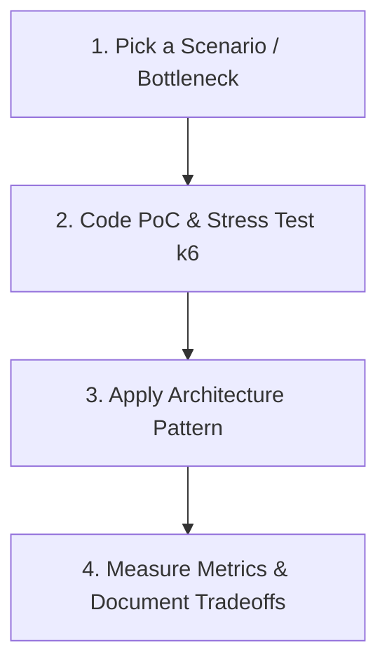
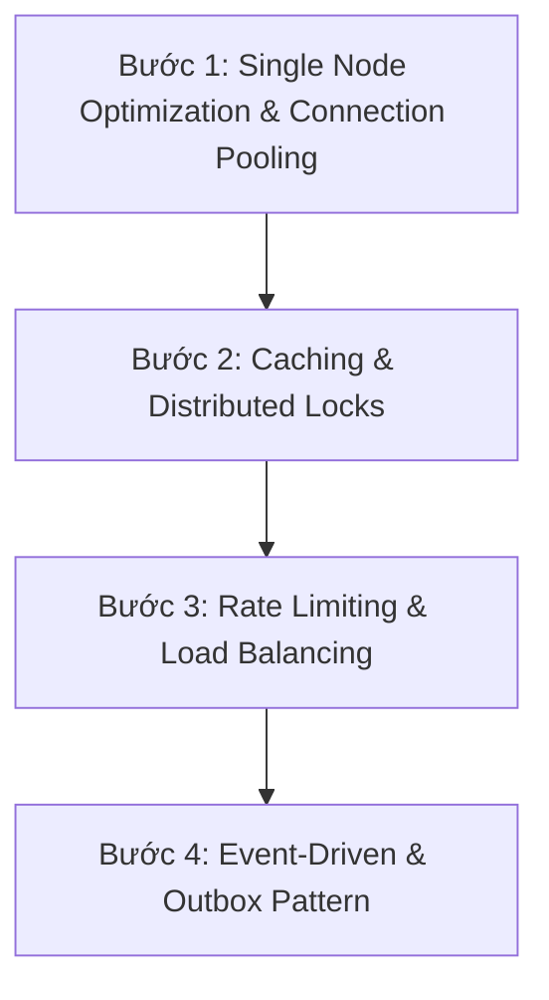

# System Design Architecture Roadmap

## TL;DR

Lộ trình học thiết kế hệ thống (System Design) cho Backend Developer đi từ nguyên lý phần cứng (Hardware Latency), tối ưu 1 nút đơn (Single Node Limits), đến các mảnh ghép kiến trúc Enterprise (Caching, Rate Limiting, Connection Pooling, Event-Driven Architecture) với nguồn tài liệu chuẩn mực thế giới như _Designing Data-Intensive Applications_ (Martin Kleppmann) và _System Design Interview_ (Alex Xu).

---

## Core Concept & Rationales

### 1. Nguyên Lý Con Số Độ Trễ

Mọi thiết kế System Design đều hướng tới việc triệt tiêu I/O Bottleneck và Network Latency:

- **L1/L2 Cache**: $\sim 0.5 - 7 \text{ ns}$
- **RAM**: $\sim 100 \text{ ns}$ (Nhanh gấp 100.000 lần đĩa cứng)
- **NVMe SSD Read**: $\sim 10-150 \text{ µs}$
- **Network Intra-Datacenter**: $\sim 0.5 \text{ ms}$
- **Network Inter-Region (Internet)**: $\sim 30-150 \text{ ms}$

### 2. Nguyên Lý Giới Hạn Đơn Nút

Không nhảy thẳng vào Microservices hay Distributed Sharding khi chưa vắt cạn 1 Server/Database instance. Một server đơn được tinh chỉnh chuẩn có thể xử lý $5.000 - 10.000 \text{ RPS}$.

---

## Practical Implementation

### Phương Pháp Học Thực Chiến

Học System Design **KHÔNG PHẢI** là ngồi đọc hết 500 trang sách _DDIA_ hay xem video Youtube thụ động. Cách học đúng nguyên lý **Evidence-Based & First Principles** diễn ra theo 4 bước khép kín:

1. **Bước 1: Giả định Bài toán thực tế (Problem Scenario)**
   - _Ví dụ với `ticket-booking`_: Hệ thống bị giật $10.000$ người cùng bấm "Đặt vé" tại 1 thời điểm (Flash Sale).
2. **Bước 2: Chạy Benchmark đo ngưỡng đổ vỡ (Find Failure Point)**
   - Dùng `k6` push $1.000 - 5.000$ Virtual Users (VUs) vào 1 node NestJS/Express + Postgres. Quan sát Latency $p95$ vọt lên bao nhiêu ms và DB bị sập connection ở đâu.
3. **Bước 3: Triển khai Kiến trúc khắc phục (Apply Pattern)**
   - Nút nghẽn DB Read? $\rightarrow$ Thêm **Redis Cache-Aside**.
   - Nút nghẽn Đặt trùng ghế? $\rightarrow$ Thêm **Pessimistic Lock (`SELECT FOR UPDATE`)** hoặc **Distributed Lock (Redis/Redlock)**.
   - Nút nghẽn Mất tin nhắn xác nhận? $\rightarrow$ Thêm **Transactional Outbox Pattern** (`outbox_events` table + Background Relay Worker).
4. **Bước 4: Benchmark lại & So sánh con số (Before vs After)**
   - Rút ra số liệu cụ thể: _"Tăng throughput từ $350 \text{ RPS} \rightarrow 4.200 \text{ RPS}$, giảm $p95$ latency từ $850\text{ms} \rightarrow 42\text{ms}$"_. Đây chính là số liệu vàng đưa vào CV!

---

### Tài Liệu & Nguồn Học Chuẩn Quốc Tế

1. **Designing Data-Intensive Applications (DDIA - Martin Kleppmann)**: "Kinh thánh" về tính tin cậy (Reliability), khả năng mở rộng (Scalability), và tính bảo trì (Maintainability). Đọc theo topic (Index, Replication, Partitioning, Transactions), không cần đọc xuôi từ đầu đến cuối.
2. **System Design Interview — An Insider's Guide (Alex Xu / ByteByteGo)**: Sách + Kênh Youtube phân tích Case Study trực quan (URL Shortener, Newsfeed, Notification System, Rate Limiter).
3. **System Design Primer (Donne Martin - GitHub)**: Kho lưu trữ mã nguồn mở tổng hợp kiến thức System Design hàng đầu thế giới.

---

### ️ Quy Trình 4 Bước Trả Lời Phỏng Vấn System Design

Khi vào vòng phỏng vấn System Design, tuyệt đối **không nhảy vào vẽ sơ đồ ngay**. Phải đi đúng 4 bước chuyên nghiệp:

1. **Step 1: Clarify Requirements & Scope (5 - 10 phút)**
   - Functional: Chức năng cốt lõi là gì? (Ví dụ: Đặt vé, xem lịch chiếu).
   - Non-Functional: High Availability ($99.99\%$), Low Latency ($<100\text{ms}$), Read/Write Ratio ($10:1$ hay $1:1$), DAU/MAU ($100.000$ active users/ngày).
   - Back-of-the-envelope estimation: Tính toán dung lượng RAM/Storage cần thiết trong 5 năm.
2. **Step 2: High-Level Architecture Design (10 - 15 phút)**
   - Vẽ sơ đồ luồng dữ liệu thô: Client $\rightarrow$ API Gateway / Load Balancer $\rightarrow$ Web App $\rightarrow$ Database.
   - Định nghĩa API Endpoints chính và Database Schema cơ bản.
3. **Step 3: Design Deep Dive (15 - 20 phút)**
   - Đi sâu vào Bottleneck theo yêu cầu người phỏng vấn: Caching Strategy, Message Queue, Distributed Lock, Database Sharding / Partitioning.
4. **Step 4: Wrap-up & Tradeoffs (5 phút)**
   - Tự chỉ ra điểm yếu của hệ thống (Single Point of Failure - SPOF) và cách khắc phục nếu scale gấp 10 lần.

---

### ️ Lộ Trình 4 Bước Thiết Kế Kiến Trúc Thực Chiến

#### Bước 1: Single Node & Connection Pooling

- Tối ưu RAM/CPU của 1 node API trước khi Scale out.
- Cấu hình **PgBouncer** hoặc Connection Pool để tránh rò rỉ bộ nhớ và giảm Context Switching trên OS:
  $$\text{Pool Size} = (\text{CPU Cores} \times 2) + \text{Effective Spindle Count}$$

#### Bước 2: Tầng Caching & Distributed Synchronization

- **Cache Patterns**: Cache-Aside vs Write-Through.
- **Xử lý 3 thảm họa Cache**:
  - _Cache Stampede / Avalanche_: Dùng Jittering TTL (thêm random ngẫu nhiên) + Redis Redlock.
  - _Cache Penetration_: Dùng Bloom Filter hoặc Cache giá trị `null` ngắn hạn.
  - _Cache Breakdown_: Dùng Mutex Lock trên Redis.

#### Bước 3: Rate Limiting & Load Balancing

- **Thuật toán Rate Limit**: Token Bucket (cho phép burst traffic) vs Sliding Window Log (dùng Redis Sorted Set).
- **Load Balancer**: Nginx / HAProxy với thuật toán Round-Robin, Least Connections, IP Hash.

#### Bước 4: Event-Driven & Transactional Outbox Pattern

- **Vấn đề Dual-Write**: Khi vừa lưu DB vừa gửi Event sang Message Queue (RabbitMQ/Redis Streams) $\rightarrow$ Dễ mất đồng bộ khi sập mạng.
- **Outbox Pattern**: Ghi Event vào bảng `outbox` trong **cùng 1 DB Transaction**, sau đó Worker chạy ngầm (Message Relay) sẽ đẩy Event sang Queue với bảo chứng _At-Least-Once Delivery_.

## Related Notes

- Lộ trình tổng thể Backend: [[Backend_Engineering_Mastery_Pipeline]]
- Hướng dẫn Benchmark SQL: [[Postgres_SQL_Performance_Benchmarking_Guide]]
- Hướng dẫn Stress Test k6: [[Local_Stress_Testing_Benchmark]]
- Mẫu thiết kế Outbox Pattern: [[Outbox_Pattern]]
