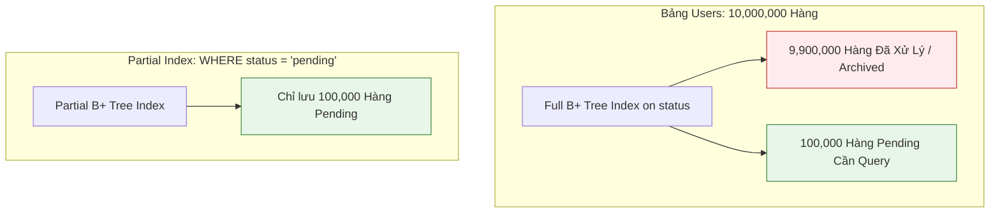

---
tags:
  - type/concept
  - topic/database
  - topic/sql
  - layer/core-mechanics
date: 2026-06-07
aliases:
  - Partial Index
  - Filtered Index
  - Index có điều kiện
description: "Kỹ thuật lập chỉ mục B+ Tree có điều kiện vị từ (WHERE) giúp tiết kiệm dung lượng đĩa, giảm overhead ghi và tối ưu hóa truy vấn chuyên biệt."
---

# Partial Index

## TL;DR

- **Bản chất**: Chỉ mục được xây dựng trên một tập con dữ liệu của bảng thỏa mãn điều kiện lọc xác định trước (`WHERE predicate`), thay vì bao phủ toàn bộ các hàng trong bảng.
- **Mục đích**: Giảm thiểu $70-90\%$ kích thước cây B+ Tree trên đĩa/RAM, triệt tiêu chi phí bảo trì Index trong các lệnh `INSERT/UPDATE` đối với các hàng không thỏa mãn điều kiện, và tăng tốc độ Index Scan.
- **Điểm mấu chốt**: Query Planner chỉ sử dụng Partial Index khi điều kiện `WHERE` trong câu truy vấn là tập con hoặc khớp chính xác với vị từ khai báo của Index (`Index Predicate Pushdown`).

---

## Core Concept



### 1. Cơ chế tiết kiệm bộ nhớ & I/O

Trong hầu hết các hệ thống thực tế, phân phối dữ liệu (Data Distribution) thường bất đối xứng:

- $99\%$ bản ghi là đơn hàng đã hoàn tất (`status = 'completed'`).
- Chỉ $1\%$ bản ghi là đơn hàng đang chờ xử lý (`status = 'pending'`).

Nếu tạo Full Index trên `status`, B+ Tree sẽ phải lưu toàn bộ 10 triệu bản ghi, gây phình to bộ nhớ đệm (Buffer Pool) và tốn I/O mỗi khi có đơn hàng mới.  
Với **Partial Index**, B+ Tree chỉ lưu $1\%$ bản ghi thỏa mãn `status = 'pending'`, giúp cây chỉ mục luôn vừa vặn trong RAM L1/L2 cache.

### 2. Các ứng dụng thực chiến kinh điển

1. **Unique Constraint kết hợp Soft Delete**:
   - Khi xóa mềm (`deleted_at IS NOT NULL`), người dùng có thể tạo lại tài khoản với cùng email.
   - Full Unique Index trên `email` sẽ báo lỗi trùng lặp khi người dùng đăng ký lại email đã xóa mềm.
   - **Giải pháp**: Tạo Unique Partial Index `WHERE deleted_at IS NULL`.
2. **Flag lọc trạng thái bất cân đối**:
   - Index trên cột boolean `is_unprocessed = true` hoặc `retry_count < 3`.

---

## Practical Implementation

### 1. Unique Index với Soft Delete (PostgreSQL)

```sql
-- Cho phép trùng email nếu đã xóa mềm, nhưng duy nhất 100% đối với bản ghi đang hoạt động
CREATE UNIQUE INDEX uq_users_active_email
ON users (email)
WHERE deleted_at IS NULL;
```

### 2. Tối ưu hóa hàng đợi công việc (Job Queue Table)

```sql
-- Chỉ index các Job chưa hoàn thành hoặc bị lỗi để worker polling
CREATE INDEX idx_jobs_pending_priority
ON background_jobs (priority DESC, created_at ASC)
WHERE status IN ('pending', 'retry');

-- Câu truy vấn sẽ kích hoạt Index Scan trên cây Partial Index siêu nhỏ:
EXPLAIN ANALYZE
SELECT * FROM background_jobs
WHERE status = 'pending'
ORDER BY priority DESC, created_at ASC
LIMIT 10;
```

### 3. Điều kiện để Query Planner chọn Partial Index

```sql
-- ĐƯỢC CHỌN (Khớp hoàn toàn với điều kiện Partial Index):
SELECT id FROM users WHERE email = 'test@example.com' AND deleted_at IS NULL;

-- KHÔNG ĐƯỢC CHỌN (Query Planner buộc phải quét bảng chính vì thiếu điều kiện WHERE):
SELECT id FROM users WHERE email = 'test@example.com';
```

---

## Related Notes

- [[Index_BPlusTree]]
- [[Database_Indexing_Guidelines]]
- [[Left_Prefix_Index_Postgres]]
- [[Prepare_Statements]]
