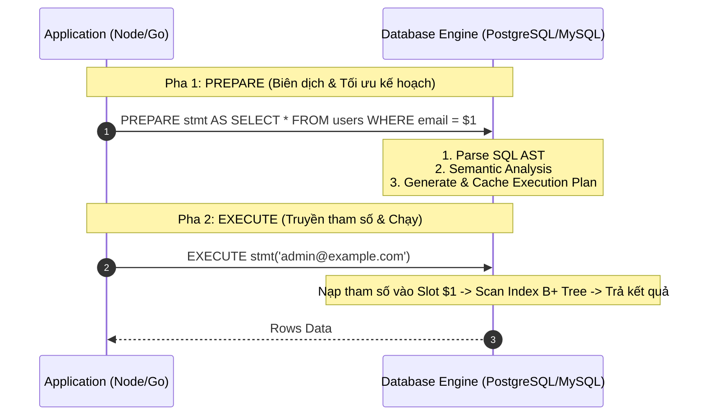

---
tags:
  - type/concept
  - topic/database
  - topic/sql
  - topic/security
  - layer/core-mechanics
date: 2026-06-07
aliases:
  - Prepare Statements in DB
  - SQL Prepare
  - Parameterized Queries
  - Prepared Statements
description: "Cơ chế phân tách Query Template và Parameters trong RDBMS nhằm tối ưu hóa Execution Plan Caching và miễn nhiễm tuyệt đối với SQL Injection."
---

# Prepare Statements

## TL;DR

- **Bản chất**: Cơ chế giao tiếp cơ sở dữ liệu phân tách quy trình thực thi SQL thành 2 pha độc lập: Pha 1 biên dịch khung truy vấn (Query Template Compilation & Optimization) và Pha 2 truyền dữ liệu tham số (Parameter Binding & Execution).
- **Mục đích**: Miễn nhiễm 100% với tấn công **SQL Injection** và tăng tốc độ xử lý hàng loạt nhờ tái sử dụng kế hoạch thực thi (**Execution Plan Cache**).
- **Điểm mấu chốt**: RDBMS coi tham số truyền vào thuần túy là giá trị văn bản/dữ liệu (literal data), tuyệt đối không bao giờ thông dịch lại cú pháp (syntax parsing) hay thay đổi cây cú pháp trừu tượng (AST) của câu lệnh.

---

## Core Concept



### 1. Cơ chế 2 pha (Two-Phase Execution Mechanics)

1. **Pha 1 - Prepare (Phân tích cú pháp & Tối ưu hóa)**:
   - Client gửi mẫu truy vấn parameterized (`SELECT * FROM tickets WHERE id = $1`).
   - Query Planner của RDBMS tiến hành kiểm tra cú pháp, giải quyết tên bảng/cột, và tính toán **Execution Plan** (Seq Scan vs. Index Scan).
   - Kế hoạch này được lưu vào bộ nhớ tạm (Session Memory Cache).
2. **Pha 2 - Execute (Gắn kết tham số & Thực thi)**:
   - Client chỉ gửi định danh Statement kèm mảng tham số nhị phân (`['TK-1002']`).
   - RDBMS bỏ qua toàn bộ bước Parse/Plan, gắn trực tiếp tham số vào Execution Plan và thực thi ngay lập tức.

### 2. Miễn nhiễm SQL Injection (Bản chất an ninh)

- Trong câu truy vấn ghép chuỗi (Dynamic String Concatenation):
  ```sql
  -- Tấn công: email = "admin' OR '1'='1"
  SELECT * FROM users WHERE email = 'admin' OR '1'='1'; -- Parser bị bẻ gãy cấu trúc AST
  ```
- Trong Prepared Statement:
  ```sql
  SELECT * FROM users WHERE email = $1;
  -- Khi truyền $1 = "admin' OR '1'='1", DB chỉ so khớp chuỗi literal chính xác trong B+ Tree Index
  ```
  Ký tự `'` hay `OR` được xử lý như một byte dữ liệu thô, không thể can thiệp vào logic điều kiện của Parser.

---

## Practical Implementation

### Node.js (pg / PostgreSQL Driver)

```typescript
import { Pool } from "pg";

const pool = new Pool();

// Prepared Statement có tên giúp PostgreSQL cache execution plan trên connection session
const query = {
  name: "fetch-user-by-id",
  text: "SELECT id, email, role FROM users WHERE id = $1 AND status = $2",
  values: [userId, "active"],
};

const result = await pool.query(query);
```

### Go (database/sql)

```go
stmt, err := db.PrepareContext(ctx, "INSERT INTO bookings(user_id, show_time_id, total_amount) VALUES ($1, $2, $3) RETURNING id")
if err != nil {
    return err
}
defer stmt.Close()

// Tái sử dụng stmt cho hàng ngàn bản ghi mà không cần re-parse SQL
for _, b := range batchBookings {
    var bookingID string
    err := stmt.QueryRowContext(ctx, b.UserID, b.ShowTimeID, b.TotalAmount).Scan(&bookingID)
    if err != nil {
        return err
    }
}
```

---

## Related Notes

- [[Index_BPlusTree]]
- [[Database_Indexing_Guidelines]]
- [[Postgres_SQL_Performance_Benchmarking_Guide]]
- [[Client_Side_Encryption]]
